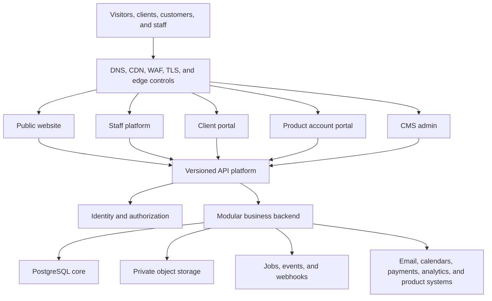
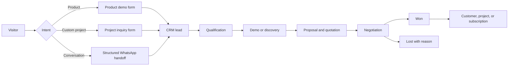
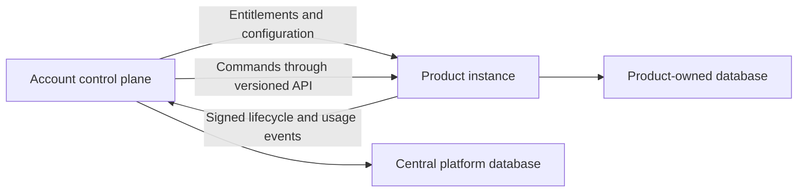

# Stack & Scale — Complete Software Company Platform Blueprint

**Version:** 1.0  
**Date:** 24 August 2026  
**Status:** Architecture approved; implementation planning ready  
**Authority:** This document consolidates the 100-question architecture interview and supersedes the narrower assumptions in `prd.md` where the two conflict.

---

## 1. Executive Summary

Stack & Scale will be presented as a software company that builds dependable products and custom digital systems—not as a generic agency selling developer hours.

The company has two connected business engines:

1. **Software products** for operational businesses, beginning with products such as POS and tailor-management systems.
2. **Custom engineering services** for Pakistani and international clients, including web platforms, mobile applications, business systems, automation, data platforms, and carefully introduced AI capabilities.

The platform must generate qualified leads today, support the company’s internal operations as it grows, and later become the control plane for its own products. The architecture therefore combines a premium public website with a CMS, CRM, staff operations platform, client portal, product-customer account portal, API platform, identity layer, billing, and shared infrastructure.

The guiding principle is:

> Build a focused, reliable core first. Preserve clean extension points for portals, products, integrations, international growth, and AI without making them dependencies of version one.

### 1.1 Three-year position

Stack & Scale should become known as a highly trusted software engineering company that delivers reliable, modern software products and custom systems for businesses—from Pakistani SMEs to international companies.

### 1.2 Initial business outcome

The first release must accomplish four things well:

- establish a premium and credible market presence;
- demonstrate real products and completed work;
- convert visitors into structured, attributable sales opportunities;
- establish the technical foundation for the broader company platform.

### 1.3 Audience priority

The brand is global, while initial commercial execution can remain local-first.

1. US companies and founders seeking a serious development partner
2. UK and Western European companies
3. Gulf companies, especially the UAE and Saudi Arabia
4. Startups building SaaS, mobile, data, automation, or AI-enabled products
5. Pakistani companies requiring substantial custom systems
6. Pakistani SMEs buying ready-made products such as POS or tailor management

The main site must serve both international engineering buyers and local product buyers without making either group navigate an irrelevant experience.

---

## 2. Product and Platform Vision

### 2.1 Platform surfaces

| Surface | Primary audience | Responsibility |
|---|---|---|
| `www.company.com` | Prospects, customers, candidates, partners | Marketing website, products, services, work, resources, lead conversion |
| `admin.company.com` | Editors and authorized staff | Payload CMS and publishing workflows |
| `staff.company.com` | Internal team | CRM, customers, projects, billing, support, product operations, reporting |
| `portal.company.com` | Custom-development clients | Project progress, milestones, documents, proposals, invoices, support |
| `account.company.com` | Product and SaaS customers | Products, subscriptions, licenses, users, billing, downloads, support |
| `api.company.com` | First-party applications and approved partners | Versioned APIs, integrations, signed webhooks |
| `status.company.com` | Customers and operations team | Public service status and incident communication |

Each surface is independently deployable and has a distinct security boundary, release cycle, and audience. They share platform capabilities through documented APIs rather than one fragile application containing everything.

### 2.2 System context



### 2.3 Architectural principles

- **API-first:** applications and external products communicate through explicit contracts.
- **Modular monolith first:** business domains are separated in code and data ownership without premature microservices.
- **Product systems remain autonomous:** a POS or future product may run on another host, cloud, platform, or local customer installation.
- **Control plane, not data warehouse:** the central platform stores accounts, subscriptions, entitlements, product-instance metadata, health, and synchronized business events; it does not require every product’s operational database to be centralized.
- **Privacy and security by design:** access, retention, consent, audit, export, and deletion are built into domain workflows.
- **Progressive complexity:** advanced automation, multi-region operation, public developer tooling, and AI are introduced only when demand justifies them.
- **Standards over lock-in:** OIDC/OAuth2, OpenAPI, webhooks, OpenTelemetry, S3-compatible storage, containers, and infrastructure as code preserve portability.

---

## 3. Brand and Experience Direction

### 3.1 Positioning

Primary positioning:

> We build software businesses depend on.

The work should lead the story. Services explain capability after the visitor has seen products, interfaces, results, and engineering proof.

### 3.2 Visual character

- Hybrid personality: trusted software company plus world-class engineering capability
- Mixed light and dark visual system
- Clean, premium, modern, and business-focused
- Logo and color palette are already defined
- Typography and the wider visual identity remain to be finalized during the design-system phase
- Premium motion throughout, with selective 3D/WebGL only when it improves product understanding
- Mobile-first composition and interaction design
- Accessibility target: WCAG 2.2 AA

The website must avoid generic agency patterns such as a hero followed immediately by an undifferentiated grid of services. It should feel like a product made by the company it represents.

### 3.3 Homepage narrative

1. **Hero:** a clear outcome-focused statement and interactive software-ecosystem composition
2. **Featured products and work:** interfaces and real systems before service claims
3. **Evidence:** outcomes, metrics, customers, testimonials, and live demonstrations
4. **Capabilities:** product engineering, business systems, mobile, data, automation, and selected AI services
5. **Industries:** relevant operational contexts without limiting the company to one vertical
6. **Delivery approach:** discovery through launch and support
7. **Resources:** useful guides, insights, tutorials, and case studies
8. **Conversion:** demo booking, project discussion, or structured WhatsApp handoff

### 3.4 Interactive hero

The hero should depict a connected software ecosystem—for example POS, mobile applications, analytics, business systems, and automation—rather than a decorative technology object. Interfaces may respond to pointer movement or scroll, but comprehension, accessibility, and performance take priority.

### 3.5 Trust system

The CMS and frontend must support:

- client testimonials;
- client logos;
- detailed case studies;
- contextual business metrics;
- team credibility and profiles;
- product screenshots, video, and live demos;
- certifications, partnerships, awards, public reviews, and video testimonials when genuine assets become available.

No fabricated metric, testimonial, client logo, or case-study result may be published.

---

## 4. Information Architecture

### 4.1 Public navigation

```text
Home
Products
├── Product catalog
├── Product detail
└── Product demo
Services
├── Product engineering
├── Custom software
├── Mobile applications
├── Business systems
├── Data and analytics
├── Automation
└── AI-enabled solutions
Industries
Work
├── Portfolio
└── Case studies
Resources
├── Guides
├── Insights
├── Tutorials
├── Case studies
├── Reports (future)
├── Documentation (future)
└── Downloads (future)
Company
├── About
├── Team
├── Careers
└── Contact
```

Navigation should remain visibly simple. Deeper content is discoverable through contextual links, search, command-palette patterns where suitable, and content relationships.

### 4.2 Capability and industry model

The site uses a hybrid structure:

- capability pages explain what Stack & Scale can build;
- industry pages translate those capabilities into the language and operational problems of a market;
- product, service, work, and resource records cross-link through CMS relationships.

This supports local intent such as “POS software for retail stores in Pakistan” and international intent such as “software product engineering partner” without duplicating the whole website.

### 4.3 Search

Public search begins as strong structured search and is designed for later semantic enhancement. Internal search is permission-aware and includes a command palette across customers, leads, projects, products, invoices, tickets, files, and actions.

AI-assisted or hybrid semantic search may be added later, but conventional indexed search remains the dependable baseline.

---

## 5. Conversion and Sales Architecture

### 5.1 Primary calls to action

- Product pages: **Book a Demo**, **Get a Quote**, **WhatsApp Us**
- Service and work pages: **Discuss Your Project**
- Resource pages: a context-specific next action or download
- Pricing: no public pricing initially; quotations remain tailored to business size, scope, integrations, onboarding, and support

### 5.2 Structured lead flow



Product qualification can collect business type, branches, users, current system, operational problems, product interest, and preferred contact method. Custom-project qualification can collect business goals, scope, timeline, budget range, and technical constraints.

### 5.3 Demo scheduling

Visitors may select an available slot or request another time. A booking creates or updates the CRM lead, records attribution, creates a sales task, and sends a professional confirmation. Calendar providers are integrations, not the source of truth for the lead.

### 5.4 WhatsApp

V1 uses structured handoff with prefilled context. A visitor chooses a need before WhatsApp opens, allowing source, campaign, page, product, and intent to be retained. Future official messaging integration can add reminders, status updates, support, and CRM conversation synchronization.

### 5.5 Lead assignment

V1 uses a shared lead pool with manual ownership. The data model supports later routing rules by product, service, geography, value, workload, or sales team.

### 5.6 CRM pipelines

The CRM supports multiple configurable pipelines rather than one fixed path.

**Product sales:** inquiry → qualified → demo → evaluation → proposal → subscription/customer  
**Custom engineering:** lead → discovery → technical assessment → proposal → contract → project  
**General:** new → qualified → demo/discovery → proposal → negotiation → won/lost

Each opportunity supports ownership, value, probability, expected close date, tasks, notes, attachments, communication history, attribution, and lost reason.

---

## 6. Public Website and CMS

### 6.1 Web application

The public website is a Next.js application using server-rendered and statically generated routes as appropriate. Content-heavy pages should be cacheable and resilient. Interactive product demonstrations remain isolated client-side components rather than forcing the entire site into a heavy browser runtime.

### 6.2 CMS choice

Payload CMS is the approved CMS. It will provide structured content, media management, versions, drafts, publishing workflows, role-based access, and controlled page composition.

### 6.3 Content model

Core collections:

- Pages
- Products
- Product features and plans
- Services
- Industries
- Projects
- Case studies
- Resources
- Authors
- Team members
- Testimonials
- Client organizations/logos
- Careers and vacancies
- FAQs
- Navigation and footer groups
- Forms and reusable calls to action
- Redirects
- Media
- Site settings

Relationships connect products, services, industries, projects, resources, and calls to action. This enables relevant recommendations and strong internal linking without duplicating content.

### 6.4 Controlled visual blocks

Editors can compose pages using an approved block library, such as:

- hero variants;
- rich text;
- feature grids;
- product interface showcases;
- metrics;
- testimonials and logos;
- galleries and video;
- comparison sections;
- process timelines;
- FAQs;
- related content;
- lead forms and CTA bands.

Editors control content and select approved variants; the design system controls spacing, typography, responsiveness, accessibility, and visual quality. New blocks are added through development review instead of unrestricted visual page building.

### 6.5 CMS workflow

Roles include administrator, publisher, editor, author, and media contributor. Permissions can be refined by collection and operation. Important content supports draft, review, approval, schedule, publish, version history, and rollback.

### 6.6 Resource center

The resource center is an authority platform rather than a stream of random blog posts.

- **Guides:** software, industry, and buying guides
- **Insights:** engineering, business technology, automation, and carefully selected AI topics
- **Case studies:** problem, solution, implementation, and result
- **Tutorials:** product and technical how-to content
- **Future:** reports, documentation, downloads, webinars, newsletters, and lead magnets

Every resource includes type, category, industry, author, reading time, SEO metadata, media, content blocks, publication state, and relationships to relevant products or services.

---

## 7. Internal Staff Platform

### 7.1 Purpose

`staff.company.com` becomes the operational workspace for the company.

```text
Dashboard
├── Leads and CRM
├── Customers and organizations
├── Projects and milestones
├── Proposals and contracts
├── Invoices and payments
├── Product subscriptions and instances
├── Demo bookings
├── Support tickets
├── Documents and files
├── Team tasks
├── Approvals
├── Knowledge base
├── Notifications
├── Reports
└── Audit activity
```

### 7.2 Access control

The default is role-based access with optional custom permission overrides. Access is evaluated server-side and enforced at both API and data-query boundaries. A hidden navigation item is never treated as an authorization control.

Likely roles include owner, administrator, sales, project manager, developer, support, finance, content editor, and viewer. Segregation of duties applies to payment verification, refunds, contract approval, publishing, permission changes, and other sensitive actions.

### 7.3 Dashboard

Dashboards are role-aware with sensible defaults. Users may add, remove, and reorder approved widgets and save personal views. This customization does not become an unrestricted page builder.

### 7.4 Global search and command palette

Authorized users can locate leads, customers, projects, tickets, invoices, files, products, and actions from one interface. Results must be filtered before retrieval according to permission and tenant—not filtered only after sensitive records are returned.

### 7.5 Customer timeline

Each customer record provides a unified timeline for CRM changes, emails, demos, proposals, payments, subscriptions, support, project events, and system actions. External conversation channels can be added later without changing the event model.

### 7.6 Tasks and approvals

V1 includes lightweight internal tasks linked to records. It remains integration-ready for specialist project-management tools. Sensitive workflows support configurable approval steps, thresholds, approver roles, comments, expiry, escalation, and immutable decision history.

### 7.7 Knowledge base

The platform supports internal announcements and a structured, searchable, permission-aware knowledge base. Articles can relate to products, support tickets, projects, customers, and staff workflows. Contextual suggestions are rule- and relationship-based initially; semantic recommendations may be added later.

### 7.8 Reporting

Reporting is architected for advanced analytics and delivered in phases. Initial reports cover pipeline, conversion, revenue, invoices, subscriptions, project status, support performance, content, and product health. Operational PostgreSQL queries should not evolve into an unbounded analytics workload; read models or a warehouse can be introduced when scale demands it.

---

## 8. Client and Product-Customer Portals

### 8.1 Custom-development client portal

`portal.company.com` gives clients a professional, transparent view of engagements.

- overview and recent activity;
- projects, milestones, progress, and client-visible tasks;
- requirements, designs, contracts, deliverables, and reports;
- proposals, versions, and acceptance status;
- invoices, payments, and receipts;
- support tickets and history;
- notifications and activity timeline.

Internal notes, engineering-only tasks, cost calculations, private documents, and team discussions remain excluded. Advanced collaboration—comments, design review, feedback boards, and real-time workflows—is a later extension.

### 8.2 Product-customer account portal

`account.company.com` is the control plane for product customers.

- purchased and active products;
- subscriptions, plans, renewals, and history;
- invoices, payments, receipts, and payment methods;
- organizations, branches, users, and roles;
- licenses, activations, devices, and instances;
- downloads, updates, and documentation;
- support tickets and notifications.

Future capabilities include usage analytics, API keys, webhooks, integrations, add-ons, marketplace features, feature management, and developer access.

### 8.3 Identity boundaries

CMS staff, company staff, custom-development clients, and product customers have distinct authorization contexts. One standards-based identity platform may authenticate them, but roles and memberships are scoped to the correct organization and application.

---

## 9. Product Platform and Integration Model

### 9.1 Central control plane

The central platform stores:

- customer and organization identity;
- product catalog and plan metadata;
- subscriptions and billing status;
- entitlements and licenses;
- product instances and deployment metadata;
- integration credentials and webhook subscriptions;
- selected health, usage, and lifecycle events;
- support and account relationships.

It does not require an external product to surrender ownership of its complete operational database.

### 9.2 Distributed product data



Products may be SaaS-hosted, hosted on a separate platform, installed on customer infrastructure, or offline-first. Integration uses authenticated APIs, signed webhooks, idempotency keys, event replay where necessary, and explicit sync ownership.

### 9.3 Offline-first products

Products that must continue during internet loss—especially POS and shop systems—use local-first operational storage and a synchronization protocol. The central platform should never turn a temporary internet outage into an inability to complete a sale.

Sync design must define conflict handling, client-generated identifiers, ordered events, retry behavior, deduplication, clock assumptions, schema compatibility, and security for compromised devices.

### 9.4 Provisioning

The universal baseline is assisted provisioning with a tracked operational checklist. Products that support automation can provision instances, organizations, licenses, and starter configuration automatically after verified payment or approved activation.

---

## 10. Commercial, Billing, and Document Workflows

### 10.1 Product commercial model

The platform supports:

- setup fees plus recurring subscriptions;
- tiered product plans;
- custom enterprise quotations;
- one-time purchases where suitable;
- taxes, discounts, credits, and adjustments as configuration rather than hard-coded product logic.

Public pricing is withheld initially. Product pages communicate value and qualification criteria, then direct buyers to a demo or quotation.

### 10.2 Local payment methods

The local-first payment model supports bank transfer, Easypaisa, JazzCash, Raast, and staff-recorded cash. The payment abstraction also reserves card, gateway, Stripe-like, and other methods for international expansion.

Manual payments follow a verification workflow:

payment submitted → reference or proof recorded → pending verification → authorized staff verifies → invoice paid → subscription or license activated.

### 10.3 Billing and accounting

The platform owns customer-facing billing workflows, invoices, receipts, payment allocation, subscription status, and audit history. It remains integration-ready for a dedicated accounting system rather than attempting to become a full general ledger.

### 10.4 Proposals and contracts

Staff can create branded quotations and proposals with structured line items, reusable content, PDF generation, version history, approval, expiry, acceptance, and conversion to contract/invoice/project. Contracts use templates and integrate with an external electronic-signature provider.

---

## 11. Communications and Notifications

### 11.1 V1 channels

V1 customer and staff communication uses:

- transactional email;
- in-app notifications;
- support tickets;
- client and account portals;
- structured CRM timeline;
- structured WhatsApp handoff for sales.

Push, SMS, automated WhatsApp messaging, and AI communication are later extensions.

### 11.2 Email architecture

Transactional email is provider-abstracted. A production email provider such as Resend or Postmark can be selected initially without embedding its API model throughout business domains.

Emails are treated as product experiences. They require responsive branded templates, accessible typography, plain-text alternatives, localization readiness, delivery tracking, suppression management, idempotent sends, preview/testing, and auditable template versions.

### 11.3 Notification preferences

Users can choose enabled V1 channels—email and in-app—per event where policy allows. Critical security, billing, or contractual notices cannot be silently disabled when delivery is legally or operationally necessary.

---

## 12. Technology Stack

### 12.1 Approved baseline

| Layer | Direction |
|---|---|
| Repository | pnpm workspace monorepo, with Turborepo or equivalent task orchestration |
| Web applications | Next.js 16.x, React 19.x, TypeScript |
| Styling | Tailwind CSS 4 with company design tokens |
| UI foundation | shadcn/ui plus Radix/Base-style accessible primitives |
| Selective visual components | Curated open-source registry components; adapted into the company design system |
| Animation | Motion for React; native CSS where sufficient |
| Advanced visuals | Three.js / React Three Fiber for isolated, justified experiences |
| Icons | Lucide |
| CMS | Payload CMS |
| Backend | NestJS modular monolith |
| API | Versioned REST/OpenAPI plus domain events and signed webhooks |
| Database | PostgreSQL core with domain-owned schemas/modules |
| Validation | Zod at frontend/application boundaries; backend DTO/schema validation |
| Forms | React Hook Form with shared schemas where appropriate |
| Files | S3-compatible private object storage and signed access URLs |
| Identity | Dedicated standards-based OIDC/OAuth2 identity platform |
| Observability | OpenTelemetry-compatible logs, metrics, traces, errors, dashboards, and alerts |
| Analytics | Privacy-controlled product and web analytics; PostHog is a suitable initial option |
| Testing | Unit/integration tooling plus Playwright for browser journeys |
| Infrastructure | Hetzner, Docker, OpenTofu/Terraform-compatible IaC |
| Delivery | GitHub Actions and GitOps-style promotion controls |
| Edge | Managed DNS, CDN, TLS, WAF, DDoS, caching, and bot controls |

Versions must be pinned and revalidated when implementation begins. Architecture is locked; patch-level package selection is an implementation concern.

### 12.2 Design-system approach

Stack & Scale will not build an isolated public component SDK before it has evidence that one is needed. Open-source primitives are brought into the repository, normalized behind company tokens and conventions, documented, tested, and maintained as internal shared packages.

Curated creative components may be used after accessibility, performance, licensing, visual consistency, and dependency review. Copying an impressive component is not sufficient justification for shipping it.

### 12.3 Proposed monorepo

```text
apps/
├── web/                 Public website
├── cms/                 Payload CMS administration
├── staff/               Internal operations
├── portal/              Custom-development client portal
├── account/             Product-customer portal
├── api/                 NestJS backend
└── workers/             Background processing entry points

packages/
├── ui/                  Company design system
├── config/              Shared lint, TypeScript, build configuration
├── contracts/           API schemas, events, generated clients
├── auth/                Authentication helpers and policy contracts
├── database/            Migrations, schema ownership, data utilities
├── observability/       Logging, tracing, metrics conventions
├── email/               Transactional templates and provider abstraction
├── analytics/           Event taxonomy and clients
└── testing/             Shared fixtures and test utilities

infrastructure/
├── environments/
├── modules/
├── containers/
├── policies/
└── runbooks/

docs/
├── architecture/
├── decisions/
├── operations/
└── product/
```

Deployable applications remain independently buildable. Shared packages must not create hidden circular dependencies or turn the monorepo into one inseparable release unit.

---

## 13. Backend and Data Architecture

### 13.1 Modular monolith

Initial backend domains include:

- identity access and memberships;
- organizations and contacts;
- leads, opportunities, and sales activities;
- products, plans, entitlements, and instances;
- subscriptions, invoices, and payments;
- projects, milestones, proposals, and contracts;
- files and documents;
- support and knowledge;
- notifications and communications;
- approvals and audit;
- reporting and integrations.

Each module owns its business rules and persistence interfaces. Cross-domain actions use application services and domain events rather than arbitrary table access.

### 13.2 PostgreSQL core

PostgreSQL is the source of truth for central transactional data. A hybrid domain architecture can use schemas, explicit ownership, and read projections to balance isolation with operational simplicity.

Important conventions:

- globally unique IDs suitable for distributed integrations;
- organization/tenant key included in tenant-owned records and indexes;
- monetary values stored in minor units with currency;
- timestamps stored in UTC and rendered in the user’s timezone;
- append-only records for critical audit and financial history;
- soft deletion only where its semantics are explicit;
- retention, anonymization, and erasure states modeled intentionally;
- optimistic concurrency or version checks for conflicting updates;
- idempotency for payments, provisioning, webhooks, and retries.

### 13.3 Migrations

All database changes use version-controlled migrations. The release path is development → review → staging migration and test → backup/readiness check → controlled production migration → verification.

Production schemas are never edited manually as a normal operating practice. High-risk migrations require forward-compatible rollout, data backfill planning, rollback or roll-forward strategy, and measured lock/runtime analysis.

### 13.4 Events and jobs

Events decouple workflows such as:

- lead qualified;
- proposal accepted;
- payment verified;
- customer created;
- subscription activated;
- product provisioning requested;
- invoice overdue;
- ticket escalated.

A transactional outbox or equivalent reliability pattern should prevent a committed business change from losing its integration event. Background jobs must be idempotent, observable, retryable, and dead-lettered after defined limits.

---

## 14. API Architecture

### 14.1 REST and contracts

REST is the primary synchronous interface. APIs are documented through OpenAPI and use consistent pagination, filtering, sorting, validation errors, correlation identifiers, authorization failures, and idempotency semantics.

Public URLs are versioned deliberately. Internal TypeScript packages may improve developer experience but never replace stable network contracts.

### 14.2 Webhooks

Outbound webhooks use signatures, timestamps, replay protection, event identifiers, delivery logs, exponential retry, endpoint disablement policy, and manual replay. Consumers must be able to process duplicate events safely.

### 14.3 Developer access

V1 exposes private APIs to first-party applications and approved product/partner integrations. The architecture is ready for a later public developer platform with documentation, application registration, scoped credentials, quotas, usage analytics, webhook management, and a sandbox.

---

## 15. Security, Privacy, and Compliance

### 15.1 Identity

A dedicated identity platform implements OIDC/OAuth2-based authentication. It should support MFA, secure recovery, session/device visibility, revocation, staff security policies, organization memberships, service accounts, and future enterprise federation.

The final identity product is selected during implementation against operational, self-hosting, UX, passkey, federation, and migration requirements.

### 15.2 Authorization

Authorization combines roles, permissions, tenant/organization boundaries, record relationships, and explicit overrides. Policies are centralized and tested. Service-to-service permissions are scoped independently from human roles.

### 15.3 Secrets

Dedicated secrets management is required from the beginning. Secrets are never committed to the repository, baked into images, exposed in client bundles, or copied into general documentation. Environments have separate credentials, rotation procedures, least-privilege access, and audit history.

### 15.4 Privacy controls from day one

- clear lawful purpose and consent for tracking;
- cookie and analytics controls;
- data minimization;
- retention policies by record class;
- export, correction, restriction, and deletion workflows;
- consent and preference history;
- processor/vendor inventory;
- privacy-safe logs and error reports;
- encrypted transport and storage;
- breach and incident procedures;
- configurable regional and contractual requirements.

GDPR-grade capability is treated as an operating requirement, even while legal documents and exact obligations are finalized with qualified counsel for each market.

### 15.5 Audit

Sensitive business and security actions create tamper-resistant audit records containing actor, action, target, organization, timestamp, origin, request correlation, and relevant before/after context. Credentials, full payment secrets, and unnecessary personal content must not enter audit payloads.

### 15.6 Application security baseline

- secure headers and TLS;
- input validation and output encoding;
- CSRF protections where cookie sessions are used;
- rate limiting and abuse prevention;
- bot/spam protection on public forms;
- dependency and container scanning;
- least-privilege database and infrastructure identities;
- signed upload/download access;
- malware scanning workflow for untrusted files where risk requires it;
- security review for authentication, tenancy, payments, webhooks, and file access;
- documented vulnerability handling and incident response.

---

## 16. Infrastructure and Delivery

### 16.1 Hosting

Hetzner is the initial infrastructure provider. The primary production and data region is Germany/EU. Backups are encrypted and stored separately from the primary failure domain.

V1 is single-region, but applications remain horizontally scalable and infrastructure definitions avoid assumptions that would prevent a later second region.

### 16.2 Edge

A managed edge layer provides DNS, SSL/TLS, CDN caching, WAF, DDoS protection, security rules, and basic bot controls. Advanced routing, edge functions, traffic intelligence, zero-trust access, and global optimization can be introduced later.

Origins should accept traffic only through approved paths where practical. Cache policy must distinguish public CMS pages from authenticated or personalized data.

### 16.3 Environments

- local development;
- automated test;
- preview environments for reviewable changes;
- staging with production-like topology and sanitized data;
- production.

Environment data, credentials, domains, integrations, and storage are isolated. Preview environments are short-lived and cannot gain production secrets by inheritance.

### 16.4 Infrastructure as code

Networks, servers, firewalls, DNS where supported, clusters/services, databases, object storage integration, monitoring, and backup policies are represented through OpenTofu/Terraform-compatible modules and automated configuration.

Manual emergency changes are recorded and reconciled back into code.

### 16.5 Delivery workflow

```mermaid
flowchart LR
    C["Code change"] --> PR["Review and automated checks"]
    PR --> PRE["Preview environment"]
    PRE --> M["Approved merge"]
    M --> ST["Staging deployment"]
    ST --> G["Migration and release gates"]
    G --> PROD["Production promotion"]
    PROD --> V["Health and business verification"]
    V -->|"Failure"| RB["Rollback or controlled roll-forward"]
```



Protected branches, mandatory review, signed/reproducible artifacts where feasible, environment approvals, migration gates, release notes, and traceable deployments form the GitOps-style workflow. The company will use mature CI/CD tooling rather than build a custom deployment engine.

### 16.6 Release strategy

High-risk services support health checks, graceful shutdown, backward-compatible API/database transitions, and canary or blue/green patterns when justified. A release is complete only after technical and critical business-flow verification.

---

## 17. Testing and Quality

### 17.1 Test layers

- unit tests for business rules and utilities;
- integration tests for database, queues, storage, and adapters;
- contract tests for APIs, events, and external providers;
- browser tests for high-value user journeys;
- migration tests against representative data;
- accessibility automation plus manual keyboard/screen-reader checks;
- performance budgets and regression checks;
- security tests for authorization, tenant isolation, upload access, webhooks, and rate limits.

### 17.2 Critical end-to-end journeys

1. visitor submits a product-demo request → lead appears → confirmation arrives → sales task is created;
2. custom-project lead → discovery → proposal → acceptance → customer and project creation;
3. payment submission → authorized verification → invoice paid → subscription/license activation;
4. customer login → correct organization and product access → forbidden cross-tenant access rejected;
5. client login → only client-visible project records and files returned;
6. editor draft → review → publish → website cache refresh and correct metadata;
7. failed provider/webhook/job → retry → deduplicated recovery → visible operational alert.

### 17.3 Performance objectives

Performance is a product requirement. Exact budgets are established per application, but the public site should target good Core Web Vitals at the 75th percentile, lean JavaScript, optimized responsive media, stable layouts, cached content, and graceful behavior on Pakistani mobile connections.

3D and animation features require reduced-motion support and measurable performance budgets. They are removed or simplified if they compromise the core experience.

---

## 18. Observability, Incidents, and Continuity

### 18.1 Observability

The platform captures structured logs, metrics, errors, and distributed traces with correlation across web requests, jobs, events, provider calls, and product integrations.

Coverage includes:

- application failures, latency, and throughput;
- database, host, disk, memory, queue, and storage health;
- authentication and authorization anomalies;
- email and webhook delivery;
- failed payments, provisioning, subscriptions, and critical workflows;
- public uptime and synthetic user journeys.

Telemetry is intentionally bounded, privacy-filtered, retained by policy, and sampled where appropriate.

### 18.2 Alerts and incidents

Alerts are actionable and routed by severity and ownership. Public incidents appear on `status.company.com`; internal incident handling records impact, timeline, decisions, communications, and follow-up actions. Mature monitoring and status tooling should be used underneath rather than rebuilt internally.

### 18.3 Backup and disaster recovery

- automated PostgreSQL backups and point-in-time recovery where supported;
- encrypted off-server/off-account copies;
- object/file versioning where appropriate;
- configuration and infrastructure recovery from code;
- documented restoration order and dependencies;
- regular automated checks plus scheduled hands-on restore exercises;
- defined recovery point and recovery time objectives per service tier;
- backup access separated from routine application credentials.

A backup is not considered reliable until restoration has been tested.

---

## 19. SEO, Analytics, and Marketing

### 19.1 SEO platform

The public platform includes:

- dynamic metadata and Open Graph assets;
- canonical URLs;
- structured data/schema;
- redirect management;
- XML sitemaps and robots controls;
- index/no-index management;
- image and media optimization;
- internal content relationships;
- Search Console integration and indexing monitoring;
- CMS fields with validation and previews.

The structure supports local Pakistan search intent now and international market expansion later. Programmatic SEO, content scoring, experiments, and keyword intelligence are future capabilities, not V1 requirements.

### 19.2 Analytics

Analytics connect anonymous acquisition activity to consented lead and customer outcomes without indiscriminate tracking.

```text
Campaign / Search / Referral
→ Landing page
→ Product, service, or resource interest
→ Demo, inquiry, or WhatsApp conversion
→ CRM lead and source
→ Opportunity and proposal
→ Customer and revenue outcome
```

An event taxonomy, consent mode, identity-transition rules, retention, access, deletion, and data-quality monitoring are defined before instrumentation expands.

### 19.3 Marketing integrations

V1 supports analytics, search visibility, calendar/demo scheduling, transactional email, and CRM attribution. Future extension points include newsletters, segmentation, lead nurturing, campaigns, A/B testing, customer journeys, and marketing automation.

---

## 20. AI and Automation Strategy

AI is an extension layer, not a V1 dependency.

The core platform must first become excellent at identity, CRM, products, billing, subscriptions, projects, support, CMS, analytics, search, notifications, and communication.

Later AI capabilities may include:

- support assistance grounded in approved knowledge;
- sales qualification and response drafting;
- semantic/hybrid search;
- content recommendations;
- workflow automation;
- operational summaries and anomaly explanations;
- customer-facing agents where business value and safety are proven.

Any AI capability requires human-control boundaries, source visibility where applicable, evaluation, privacy review, cost controls, fallback behavior, and auditability. Core workflows must continue when an AI provider is unavailable.

---

## 21. Delivery Roadmap

### Phase 0 — Definition and foundations

**Outcome:** implementation-ready contracts and delivery environment.

- confirm company domain and production subdomains;
- capture finalized logo/color assets and define typography;
- inventory products, services, projects, testimonials, and content;
- establish monorepo, design tokens, coding standards, and ADRs;
- choose identity, email, edge, object-storage, and observability providers;
- define security model, event taxonomy, environments, and infrastructure modules;
- turn this blueprint into prioritized requirements and acceptance tests.

### Phase 1 — Public foundation and lead engine

**Outcome:** professional online presence and qualified lead generation.

- public website and responsive design system;
- Payload CMS and publishing workflow;
- products, services, industries, work, resources, and company content;
- advanced SEO baseline;
- structured forms, demo scheduling, and WhatsApp handoff;
- lightweight configurable CRM;
- identity foundation and staff access;
- transactional emails;
- analytics and attribution;
- Hetzner infrastructure, edge, CI/CD, observability, backup, and security baseline.

### Phase 2 — Business operations platform

**Outcome:** the company can run core internal operations in one controlled system.

- expanded CRM and customer records;
- projects, milestones, tasks, and approvals;
- proposals, contracts, files, invoices, and payments;
- support, notifications, knowledge, audit, and operational reporting;
- product/subscription records and provisioning workflows.

### Phase 3 — Customer platforms

**Outcome:** clients and product customers receive professional self-service experiences.

- `portal.company.com` for custom-development clients;
- `account.company.com` for product customers;
- subscriptions, billing, licenses, organization users, files, support, and notifications;
- hardened tenant isolation and customer-facing audit/security features.

### Phase 4 — Product platform

**Outcome:** Stack & Scale can operate a portfolio of connected products.

- POS and tailor-system integrations;
- entitlement, licensing, instance, and provisioning APIs;
- offline synchronization standards where required;
- private partner integrations and product health events;
- developer documentation foundations.

### Phase 5 — Intelligence and scale

**Outcome:** proven workflows gain selective intelligence and broader scale.

- advanced analytics and warehouse/read models;
- marketing and operational automation;
- evaluated AI assistance and agents;
- public developer platform or marketplace if commercially justified;
- advanced edge and multi-region capabilities where reliability or geography requires them.

---

## 22. Phase 1 Scope Boundary

Phase 1 should not attempt to deliver the complete long-term platform.

### Included

- public website;
- CMS and content models;
- design system foundation;
- products, services, work, resources, and lead pages;
- structured lead capture and CRM basics;
- demo scheduling and WhatsApp handoff;
- transactional confirmations;
- SEO, consent-aware analytics, and attribution;
- identity foundation for staff;
- production infrastructure, deployment, monitoring, security, and backups.

### Deferred

- full client and product-customer portals;
- comprehensive project/billing/support operations;
- advanced product provisioning and offline sync;
- public developer platform;
- marketing automation suite;
- multi-region active operation;
- AI agents and AI-dependent workflows;
- marketplace and add-on ecosystem.

Deferred features still influence interfaces and data boundaries, but they must not burden Phase 1 with unused implementation complexity.

---

## 23. Implementation Gates

Implementation may begin when the following are ready:

- brand assets and typography direction;
- confirmed domain/subdomains;
- initial product, service, project, and case-study inventory;
- real trust assets or an explicit plan for honest placeholders;
- Phase 1 requirement backlog and acceptance criteria;
- provider decisions for identity, email, edge, object storage, and observability;
- initial data classification and retention schedule;
- infrastructure budget and recovery objectives;
- named owners for content approval, sales follow-up, security, and production operations.

These are execution inputs, not reasons to revisit the approved architecture.

---

## 24. Success Measures

### Business

- qualified leads by audience, product/service, and source;
- lead-to-demo, demo-to-proposal, and proposal-to-win conversion;
- pipeline value and sales-cycle duration;
- product activation and renewal outcomes;
- revenue attribution by campaign/content source.

### Experience

- visitors can understand the company’s products and engineering capability quickly;
- high-value actions are reachable without confusing navigation;
- forms, booking, and portals work well on mobile and assistive technology;
- customer communications are clear, branded, and dependable.

### Engineering

- critical journeys pass automated and release verification;
- tenant and authorization tests prevent cross-boundary access;
- performance budgets and Core Web Vitals remain healthy;
- deployments are repeatable and traceable;
- recovery exercises meet agreed objectives;
- incidents and failed business workflows are detected before customers report them where feasible.

### Content and search

- important pages are indexed correctly;
- content relationships create meaningful internal navigation;
- local and international search landing pages attract relevant intent;
- resource content contributes to qualified opportunities, not traffic alone.

---

## 25. Final Architecture Decision

Stack & Scale will use a production-grade, scalable software-company architecture built around a premium CMS-driven website, API-first modular backend, PostgreSQL core, standards-based identity, independently deployable staff and customer applications, Hetzner-based infrastructure, and disciplined delivery operations.

The platform is product- and service-capable, local-first and globally positioned, privacy-conscious from day one, AI-ready without being AI-dependent, and structured to evolve in controlled phases.

This is the approved target architecture. The next planning artifact should map each of the 100 interview questions to its chosen decision, rationale, tradeoffs, phase, and expected benefit.
