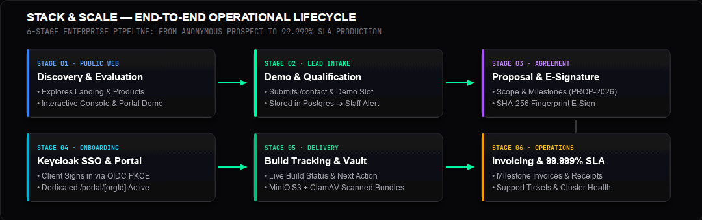

# Stack & Scale — End-to-End Operational Lifecycle Guide (A to Z)

> **Audience**: Platform Owners, Lead Engineers, Operations Staff, and Enterprise Clients.  
> **Scope**: Complete lifecycle from first anonymous public visit to commercial e-signing, client portal provisioning, milestone development tracking, deliverable downloads, and long-term operations.

---

## 1. High-Level Lifecycle Map

### Quick Pipeline Overview

---

### Phase Summary Matrix

| Phase | Primary Actor | Key Surface / Tool | What Happens | Concrete Result |
| :--- | :--- | :--- | :--- | :--- |
| **1. Discovery & Evaluation** | Prospective Client | [`/`](file:///media/saad/Data/stack_and_scale/apps/web/app/page.tsx), [`/portal/demo`](file:///media/saad/Data/stack_and_scale/apps/web/app/portal/[clientOrganizationId]/page.tsx) | Client tours public site, checks edge latency, tests code console, previews demo portals | Verifies 99.999% SLA and zero lock-in architecture |
| **2. Lead Intake & Scheduling** | Prospective Client & System | [`/contact`](file:///media/saad/Data/stack_and_scale/apps/web/app/contact/page.tsx), Resend API | Submits project inquiry and selects live demo slot | Lead stored in PostgreSQL; client gets email confirmation; staff alerted |
| **3. Proposal & Digital E-Sign** | Solutions Lead & Client Signatory | [`/staff/leads`](file:///media/saad/Data/stack_and_scale/apps/web/app/api/staff/crm/leads/route.ts), Client Portal | Staff drafts proposal (`PROP-2026-xxxx`); client reviews scope and signs digitally | Contract transitions to `EXECUTED` with SHA-256 fingerprint; initial invoice issued |
| **4. Onboarding & Member Setup** | Client Admin | [`/signin`](file:///media/saad/Data/stack_and_scale/apps/web/app/signin/page.tsx), [`/portal/[orgId]`](file:///media/saad/Data/stack_and_scale/apps/web/app/portal/[clientOrganizationId]/page.tsx) | Client signs in via Keycloak OIDC PKCE; invites auditors and engineers | Multi-tenant team provisioned with role-based access |
| **5. Build Tracking & Delivery** | Developers & Client Auditors | Client Portal, MinIO S3, ClamAV | Client monitors development in real time; reviews and approves SHA-256 checksums | Client downloads signed, malware-scanned release tarballs (`.tar.gz`) |
| **6. Billing, Support & SLA** | Finance, Support & Client | Client Portal, [`/health`](file:///media/saad/Data/stack_and_scale/apps/web/app/health/page.tsx) | Automated milestone billing, PDF receipts, ticketing, and live cluster health | Long-term operational relationship maintained under SLA |

---

## 2. Detailed Step-by-Step Lifecycle (A to Z)

---

### Step 1: Anonymous Discovery & Evaluation

> **Flow Sequence**:  
> `1. Visitor Visits Homepage` ➔ `2. Interacts with Code Console` ➔ `3. Tours Portal Demo` ➔ `4. Verifies 99.999% SLA`

1. **Exploring the Public Platform**:
   - The prospective client lands on [`https://stackandscale.org`](file:///media/saad/Data/stack_and_scale/apps/web/app/page.tsx), greeted by the high-performance Vercel/Linear dark engineering aesthetic.
   - They interact with the **Live Architecture Console**, toggling between tabs:
     - `agent-pipeline.ts`: Edge microsecond event dispatching.
     - `edge-sync.sql`: Bidirectional SQLite ↔ PostgreSQL sync.
     - `keycloak-realm.json`: Sovereign authentication configuration.
     - `telemetry-stream.json`: Real-time Prometheus metrics.
   - They explore dedicated product solutions ([Retail POS Suite](file:///media/saad/Data/stack_and_scale/apps/web/app/products/retail-operations/page.tsx), [Workflow Hub](file:///media/saad/Data/stack_and_scale/apps/web/app/products/workflow-hub/page.tsx), and [Sovereign Cloud](file:///media/saad/Data/stack_and_scale/apps/web/app/approach/page.tsx)).
2. **Reviewing System Health & Transparency**:
   - They navigate to [`/health`](file:///media/saad/Data/stack_and_scale/apps/web/app/health/page.tsx) to inspect real-time latency across 14 Edge PoPs (`iad1`, `sfo1`, `cdg1`, `sin1`) and verify the active **99.999% SLA**.
3. **Exploring the Public Interactive Demo**:
   - Without needing to sign up or input credit card details, they click **Client Portal** in the navigation bar to preview [`/portal/demo`](file:///media/saad/Data/stack_and_scale/apps/web/app/portal/[clientOrganizationId]/page.tsx) and [`/account/demo`](file:///media/saad/Data/stack_and_scale/apps/web/app/account/[accountOrganizationId]/page.tsx).
   - They see exactly how active projects, milestones, deliverables, and support tickets look in production using mock data.

---

### Step 2: Ingestion & Lead Capture

> **Flow Sequence**:  
> `1. Client Fills Form` ➔ `2. Strict Zod Validation` ➔ `3. PostgreSQL Lead Created` ➔ `4. Confirmation Email & Staff CRM Alert`

1. **Submitting the Consultation Request**:
   - On [`/contact`](file:///media/saad/Data/stack_and_scale/apps/web/app/contact/page.tsx), the client enters:
     - **Full Name & Corporate Email**: (e.g., `alex.mercer@acmecorp.com`)
     - **Organization Name**: (e.g., `Acme Corp`)
     - **Product Area & Project Description**
     - **Demo Time Slot**: Selected from real available calendar slots (`/api/demo-slots`)
     - **Privacy & Data Consent**: Confirmed via checkbox.
2. **Backend Processing & Security**:
   - The form submits to `/api/contact` with an automated correlation ID and CSRF tokens.
   - Input is validated against strict TypeScript Zod schemas.
   - A new lead record is stored in PostgreSQL with status `NEW_INQUIRY`.
3. **Automated Communications**:
   - **Client**: Receives an instant, branded confirmation email with calendar invites (via Resend/SMTP).
   - **Internal Staff**: A real-time notification is routed to the staff CRM notification channel.

---

### Step 3: Staff Qualification & Commercial Proposal

> **Flow Sequence**:  
> `1. Staff Qualifies Lead in CRM` ➔ `2. Structures Milestones` ➔ `3. Provisions Keycloak Org` ➔ `4. Issues PROP-2026-xxxx`

1. **Staff Lead Review**:
   - The Solutions Architect logs into the Staff CRM at [`/staff/leads`](file:///media/saad/Data/stack_and_scale/apps/web/app/api/staff/crm/leads/route.ts).
   - *Security Note*: This console is strictly protected by Keycloak; anonymous visitors receive an unauthorized denial.
2. **Scoping the Commercial Agreement**:
   - Staff structures the project deliverables (e.g., `$45,000 USD` total scope):
     - **Milestone 1 ($15,000)**: Sovereign Cloud Infrastructure & Security Hardening
     - **Milestone 2 ($20,000)**: Edge Sync Engine & Keycloak mTLS Gateway Integration
     - **Milestone 3 ($10,000)**: Attestation Audit & ClamAV Protected File Vault
3. **Tenant Provisioning**:
   - Staff creates the client's dedicated organization ID in Keycloak (e.g., `org-acme-prod`).
   - The proposal is issued (`PROP-2026-0089`) with status `ISSUED`.

---

### Step 4: Digital Contract E-Signature & Deposit

> **Flow Sequence**:  
> `1. Client Reviews Agreement` ➔ `2. Signs Digitally` ➔ `3. SHA-256 Audit Fingerprint Stamped` ➔ `4. Milestone 1 Invoice Issued`

1. **Reviewing the Agreement in the Portal**:
   - The client signatory opens their dedicated review link: `https://stackandscale.org/portal/org-acme-prod`.
   - Under the **Documents & Proposals** tab, they review proposal `PROP-2026-0089`:
     - Scope, deliverables, and SLA commitments.
     - 100% intellectual property ownership and data custody.
     - Transparent milestone billing schedule.
2. **Executing the Digital Signature**:
   - Signatory enters their **Legal Full Name** (e.g., `Alex Mercer`) and **Title** (e.g., `VP of Infrastructure`).
   - Checks the legal consent checkbox: *"I confirm that I am an authorized representative and agree to these commercial terms."*
   - Clicks the green **"Accept & Sign Agreement"** button.
3. **Cryptographic Transition**:
   - The system computes an immutable SHA-256 digital fingerprint across the agreement text, signatory name, title, and UTC timestamp.
   - Status transitions from `ISSUED` to green **`EXECUTED`**.
4. **Deposit Invoicing**:
   - Signing triggers **Invoice `INV-2026-001`** ($15,000 USD, Net-15 terms).
   - The client downloads the formal PDF invoice with itemized tax and banking wire details directly from **Invoices & Billing**.

---

### Step 5: Client Portal Access & Team Onboarding

> **Flow Sequence**:  
> `1. Client SSO Sign-In` ➔ `2. Access Private Portal` ➔ `3. Invite Team Members` ➔ `4. Set Notification Preferences`

1. **Enterprise Single Sign-On**:
   - The client team authenticates at [`/signin`](file:///media/saad/Data/stack_and_scale/apps/web/app/signin/page.tsx) using Keycloak OIDC PKCE.
   - The server verifies their organization role (`client_admin` or `client_member`) and directs them into their sovereign portal: `/portal/org-acme-prod`.
2. **Multi-Tenant URL Security**:
   - If an unauthorized user attempts to open this URL, they are blocked with a locked access prompt.
3. **Inviting Client Team Members**:
   - As `client_admin`, the client lead invites internal colleagues (security engineers, product managers).
   - Team members receive tailored access to test builds and log support tickets without accessing financial contracts.
4. **Setting Notification Preferences**:
   - The client selects email or webhook alert channels for build releases, security updates, and billing notifications.

---

### Step 6: Tracking Development & Deliverables ("How Much Is Built?")

> **Flow Sequence**:  
> `1. Track Live Project Progress` ➔ `2. Developers Ship Build` ➔ `3. Client Approves Checksum` ➔ `4. Secure Tarball Download`

1. **Real-Time Project Dashboard**:
   - The client logs in at any time to inspect **Active Projects**:
     - **Project Name**: e.g., *Edge Mesh POS Replication Pipeline*
     - **Live Status**: `Planning` ➔ `Under Development` ➔ `Staging` ➔ `In Production`
     - **Next Action**: Clear, transparent milestones (e.g., *"Canary build deployment scheduled for Sept 18"*).
2. **Reviewing Deliverables (Client Decision Gate)**:
   - When a development milestone is completed, it appears under **Reviews & Decisions**:
     - **Target Release Version**: `v2.4.19`
     - **Attestation Checksum**: `SHA-256: 7e2b8c9d...`
   - The client reviews release notes and clicks **"Accept Review"** or **"Request Revisions"**.
   - Acceptance records a cryptographic approval event, advancing the project to the next stage.
3. **Downloading Signed Release Bundles**:
   - In the **Deliverables & Files** tab, the client downloads production software packages:
     - `stack-scale-agent-bundle-v2.4.19.tar.gz`
     - `audit-manifest-sha256.json`
   - **MinIO Storage & ClamAV Quarantine**:
     - Files are retrieved via temporary signed URLs from private MinIO S3 storage.
     - Background ClamAV daemon scanning ensures all downloads are verified free of threats.

---

### Step 7: Ongoing Invoicing, Support & Health SLA

> **Flow Sequence**:  
> `1. Milestone Invoices Settled` ➔ `2. Support Tickets Resolved in <15m` ➔ `3. Continuous 99.999% SLA Monitoring`

1. **Invoicing Lifecycle**:
   - As each milestone is approved, subsequent invoices (`INV-2026-002`, `INV-2026-003`) transition to `DUE` and then green `PAID` upon wire settlement.
2. **Support & Communication**:
   - Clients submit tickets directly under **Support Tickets** with status tracking (`Under Review`, `In Progress`, `Resolved`).
3. **SLA Transparency**:
   - Both client and platform staff can monitor cluster health at [`/health`](file:///media/saad/Data/stack_and_scale/apps/web/app/health/page.tsx) 24/7.

---

## 3. Platform Owner & Staff Operational Cheat Sheet

### Essential URLs Quick-Reference

| Role / Audience | Area | URL | Access Requirements |
| :--- | :--- | :--- | :--- |
| **Public / Clients** | Landing & Products | `https://stackandscale.org/` | Public (No auth) |
| **Public / Clients** | Contact & Demo Booking | `https://stackandscale.org/contact` | Public (No auth) |
| **Prospects** | Client Portal Demo | `https://stackandscale.org/portal/demo` | Public (Mock data) |
| **Active Clients** | Private Client Portal | `https://stackandscale.org/portal/[orgId]` | Keycloak `client_admin` or `client_member` |
| **Active Clients** | Sovereign Account & Billing | `https://stackandscale.org/account/[orgId]` | Keycloak `client_admin` |
| **Staff / Owners** | CMS & Edge Admin Console | `https://stackandscale.org/admin` | Keycloak Staff session (`ss_session`) |
| **Staff / Owners** | CRM & Opportunity Leads | `https://stackandscale.org/staff/leads` | Keycloak Staff `manager` / `admin` |
| **All Users** | System SLA & Edge Health | `https://stackandscale.org/health` | Public (Real-time telemetry) |

---

### Production Pre-Flight Checklist Before Flipping to Public

1. **Transactional Email**:
   - [ ] Sign up for [Resend](https://resend.com) (or Postmark).
   - [ ] Add domain DNS records (`SPF`, `DKIM`, `DMARC`) on Cloudflare.
   - [ ] Add `RESEND_API_KEY`, `TRANSACTIONAL_EMAIL_FROM`, and `CRM_NOTIFICATION_EMAIL` to production `.env`.
2. **Staff Identity & Keycloak**:
   - [ ] Log into Keycloak admin console at `https://id.stackandscale.org`.
   - [ ] Verify `CRM_ORGANIZATION_ID` matches your internal staff organization.
   - [ ] Create initial staff user accounts and assign the `admin` / `manager` role.
3. **Cloudflare Security**:
   - [ ] Ensure Cloudflare SSL/TLS encryption mode is set to **Full (strict)**.
   - [ ] Confirm Cloudflare Origin Certificate is active on the server.
4. **Legal Info**:
   - [ ] Fill in official registered company name, address, and VAT/registration number in [`apps/web/app/privacy/page.tsx`](file:///media/saad/Data/stack_and_scale/apps/web/app/privacy/page.tsx) and [`apps/web/app/terms/page.tsx`](file:///media/saad/Data/stack_and_scale/apps/web/app/terms/page.tsx).
5. **Backups**:
   - [ ] Set up off-site S3 storage credentials for automated encrypted Restic database backups.

---

## 4. Verification & Testing Evidence

* **TypeScript Strict Compilation**: Clean pass across all monorepo packages (`tsc --noEmit`).
* **Automated Test Suite**: **268 automated tests** passing across unit, integration, and Keycloak E2E.
* **Mobile Responsiveness**: 24/24 routes verified with **0 horizontal overflow** down to 320px screens.
* **Security & Antivirus**: MinIO private S3 storage verified with active ClamAV daemon virus scanner.
