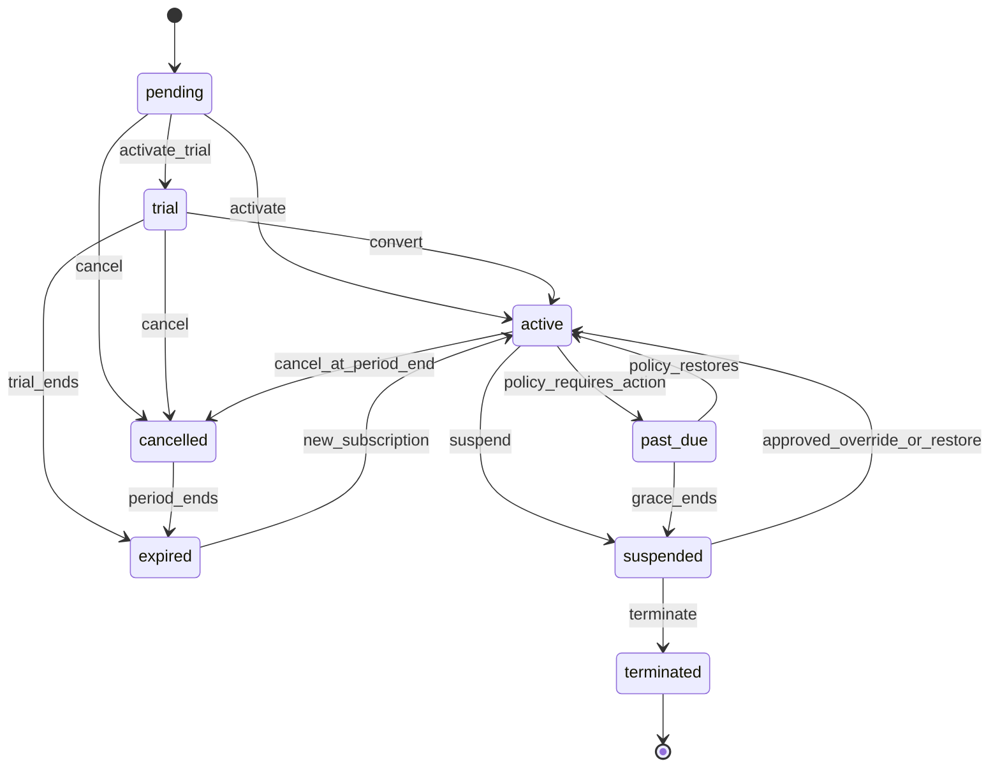
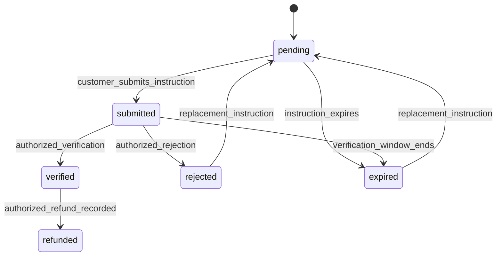
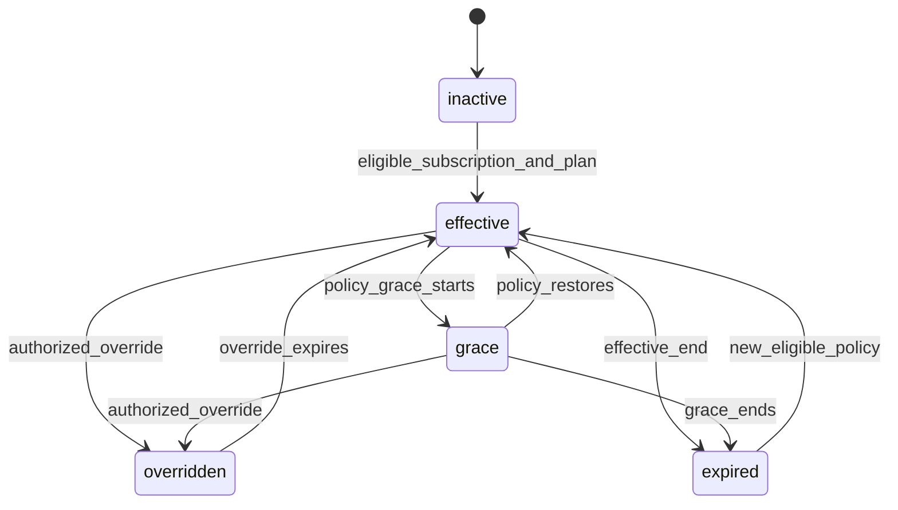
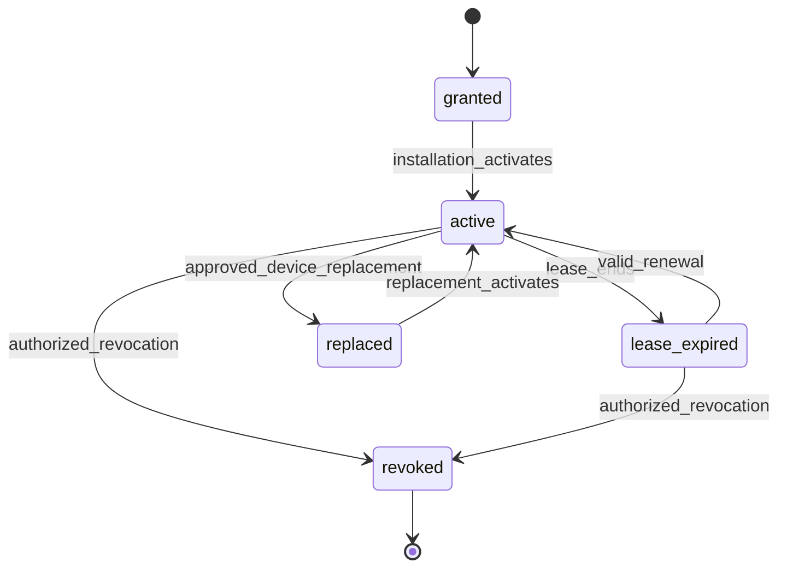

# Product control plane contracts

## Status

**Frozen technical baseline — version 0.1 (2026-08-31).**

This contract governs Phase 16's product-customer account system. It is
separate from the Phase 15 custom-development client portal and from product
runtime databases. A versioned amendment with product and security review is
required for any change to its shared identifiers, states, event envelopes,
isolation rules or signing-key metadata.

## Domain boundary

- The control plane owns product catalogue, account membership, subscription,
  entitlement, license, installation and release metadata.
- Phase 14 remains canonical for commercial agreement, invoice, payment,
  receipt, document, support and provisioning records. Phase 16 uses bounded
  projections and never reconciles or mutates those records.
- Products retain operational autonomy. They consume signed, time-bounded
  entitlement snapshots and must tolerate a control-plane outage within their
  lease/grace policy.
- A platform identity becomes a product-account principal only through an
  explicit membership scoped to one product-customer organization.

## Shared identifiers and isolation

Every control-plane read/write carries `organization_id`,
`product_account_organization_id`, `product_id`, and an authenticated actor
where applicable. A branch, subscription, license, installation, snapshot or
download is accessible only after resolving that account membership and the
product relationship. Identifier existence must not change a cross-organization
response.

No API serializes internal Phase 14 payment evidence, private support notes,
storage keys, signing keys, control-plane audit metadata, runtime telemetry or
another customer's records.

## Independent state machines

### Subscription

Subscription transitions are append-only events with actor, reason, effective
time and idempotency key. A manual override has an explicit expiry and audit
record. Subscription state never directly represents an invoice, payment,
entitlement or license state.

### Payment

Payment is canonical Phase 14 data. Phase 16 may render an allow-listed view;
it cannot use a payment transition as entitlement authorization.

### Entitlement

An effective entitlement is a deterministic resolution of a versioned plan,
add-ons, organization overrides and effective time. Its snapshot includes a
contract version, subject, issued/expiry times and key identifier; it does not
contain private signing material.

### License and installation

An installation accepts only an entitlement lease newer than its last accepted
sequence/time window. It never accepts an older lease to restore revoked
access. Product verification keys use versioned public metadata with rotation
overlap; private keys live outside application data and source control.

## Event and API compatibility

- APIs are versioned and DTO allow-listed. State-changing commands require an
  idempotency key and emit one auditable domain event.
- Consumers receive immutable IDs, state, reason category, effective time,
  contract version and correlation ID; they do not receive staff identities or
  raw provider payloads.
- Delayed and duplicate provider events are deduplicated by provider/event key
  before state evaluation.
- Breaking change requires a new event/API version and an overlap migration;
  silent reinterpretation of historical plan, entitlement or lease data is
  forbidden.

## Security, privacy and recovery

- Account, automated billing, download and license-enforcement flags are
  independent and disabled by default for new product organizations.
- Financial, license recovery and download actions require an appropriate
  sensitive-session/MFA claim and authorization decision audit.
- Compromised-key recovery prevents new leases from the affected key, publishes
  replacement verification metadata, preserves legitimate outage grace where
  safe, and does not mass-revoke installations solely because of a deployment.
- Release downloads are authorized, signed, checksummed, time-bounded and
  audited. Permanent public object URLs are prohibited.

## Approval record

| Field | Value |
| --- | --- |
| Contract version | `0.1` |
| Source decisions | 011, 012, 013, 028, 031–033, 040–046, 051, 079, 084–085, 088 and 090 |
| Product-owner authorization | Workspace-owner authorization to start Phase 16, 2026-08-31 |
| Security review requirement | Required before implementation amendment or production feature enablement |
| Consumer merge rule | `16.1` and later consume this version unchanged |
