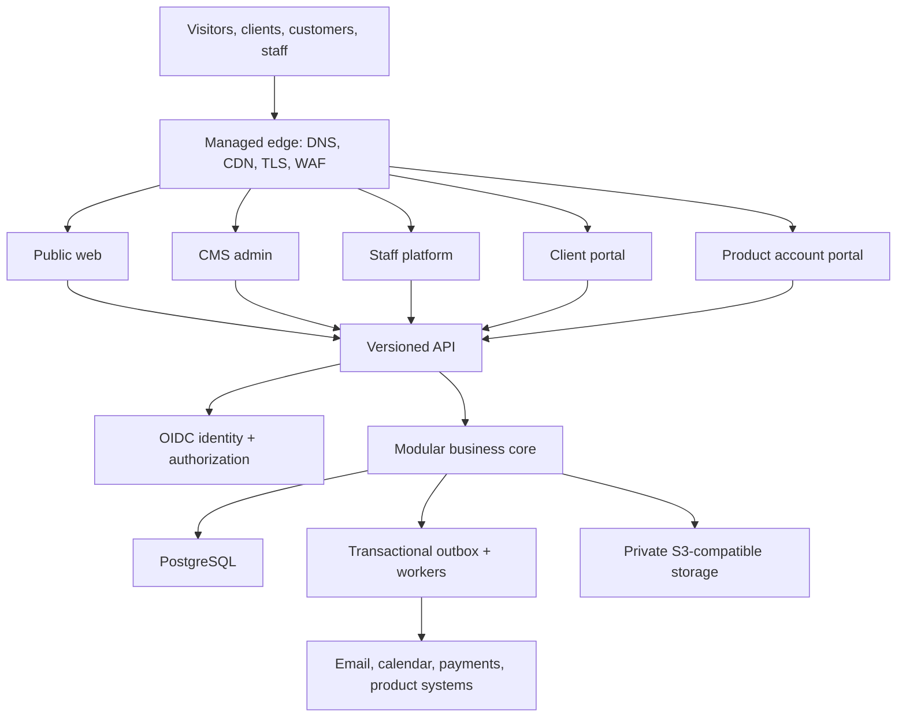

# System Architecture

## Decision

Stack & Scale begins as a modular NestJS monolith with a PostgreSQL transactional core. Public web, CMS, staff, client portal and product-account portal are independently deployable surfaces that call documented APIs; they do not reach each other's database tables.

## Trust boundaries

| Boundary | Allowed | Never allowed |
|---|---|---|
| Public web | published CMS content; anonymous lead submission | staff/client/account data or database credentials |
| CMS admin | authenticated editorial workflow | direct production database editing or arbitrary executable code |
| Staff | permission-filtered internal operations | automatic access to every organization without policy decision |
| Client portal | client-visible project, document, invoice and support records | credentials, secret values or another organization's records |
| Account portal | organization-scoped subscriptions, licenses, users and billing | product operational data not explicitly synchronized to the control plane |
| API | authenticated, versioned commands and reads | unscoped internal table access or public partner access in V1 |
| Workers/integrations | idempotent, scoped event processing | bypassing domain authorization or writing unowned tables |

## Product autonomy

The central platform owns commercial control-plane data: organizations, memberships, products, plans, entitlements, subscriptions, instances and integration credentials. A POS, tailor system or future product owns its operational data and continues its core operation when the central control plane is unavailable. Synchronization uses versioned API contracts and signed events.

## Deployment view

V1 runs in the EU/Germany region on Hetzner behind a managed edge. Development, test, preview, staging and production remain credential- and data-isolated. Production origins accept only approved edge/reverse-proxy traffic where practical. No paid platform is required by this design; self-hosted Postgres, workers, CMS, identity and storage-compatible services remain valid choices.
