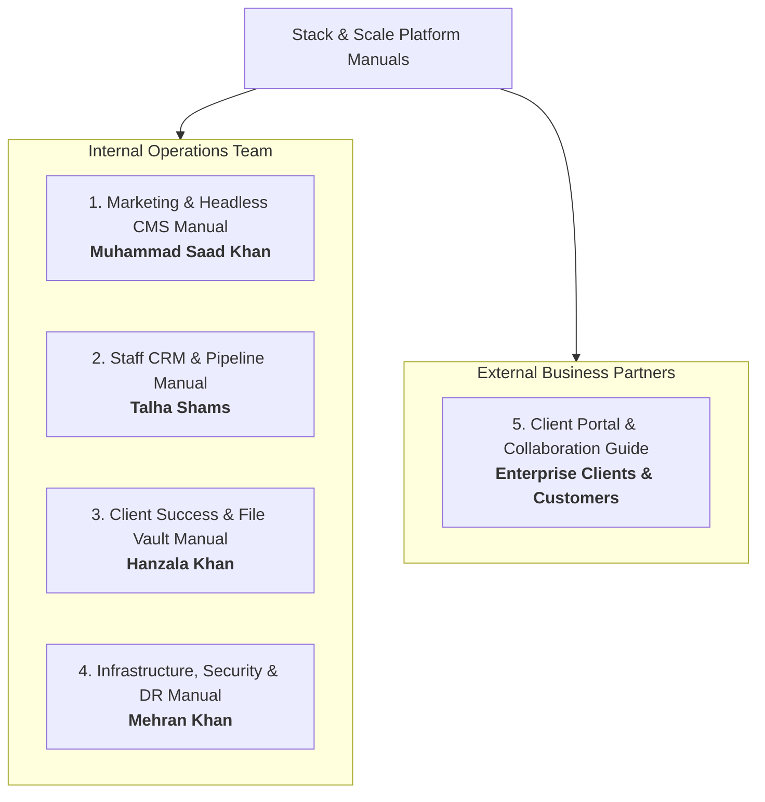

# Stack & Scale — Official Platform User Manuals

> **Platform Version:** 1.0.0 Production  
> **Target Cluster:** OVHcloud Dedicated Host (`51.195.136.215` / `stackandscale.org`)  
> **Identity Provider:** Keycloak 26 OIDC (`identity.stackandscale.org`)  
> **Last Revised:** September 2026

Welcome to the authoritative operational manual suite for **Stack & Scale**. This library provides complete, role-specific operating instructions for internal team members and external clients.

---

## 1. Manuals Directory & Quick Navigation

| Manual | Primary Audience | Core Systems Covered | Document Link |
| :--- | :--- | :--- | :--- |
| **Manual 1** | **Marketing & Growth Lead** *(Muhammad Saad Khan)* | Public Website, Command Palette, Hero, Pricing, Payload Headless CMS, Article Publishing, SEO & Lead Funnel | [1-MARKETING-AND-CMS-MANUAL.md](./1-MARKETING-AND-CMS-MANUAL.md) |
| **Manual 2** | **Staff Operations Lead** *(Talha Shams)* | Keycloak SSO, Staff Lead 360 Inbox, Opportunity Pipeline, Proposal Generator, Line Item Pricing, Notification Center | [2-STAFF-OPERATIONS-AND-CRM-MANUAL.md](./2-STAFF-OPERATIONS-AND-CRM-MANUAL.md) |
| **Manual 3** | **Client Success Lead** *(Hanzala Khan)* | Multi-Tenant Client Portal, Product Accounts, Contract E-Signatures, Invoicing, MinIO S3 File Vault & ClamAV Quarantine | [3-CLIENT-PORTAL-AND-STORAGE-MANUAL.md](./3-CLIENT-PORTAL-AND-STORAGE-MANUAL.md) |
| **Manual 4** | **Platform Reliability Lead** *(Mehran Khan)* | Cloudflare Perimeter, TLS 1.3 Full (Strict), Grafana Telemetry, Loki LogQL Queries, Keycloak Master Realm, Chaos Drills & Database Backups | [4-INFRASTRUCTURE-SECURITY-AND-DR-MANUAL.md](./4-INFRASTRUCTURE-SECURITY-AND-DR-MANUAL.md) |
| **Manual 5** | **Client / Partner Persona** *(Acme Corp, etc.)* | Portal Access, Proposal Review, Milestone Approval, Digital E-Signatures, Invoice PDF Downloads, S3 Asset Exchanges | [5-CLIENT-ONBOARDING-AND-PORTAL-GUIDE.md](./5-CLIENT-ONBOARDING-AND-PORTAL-GUIDE.md) |

---

## 2. Standard Operating Procedures (SOP) Quick Reference

### For Internal Staff:
1. **Always authenticate via SSO:** Navigate to `https://stackandscale.org/signin` or `https://stackandscale.org/staff` to start your secure session.
2. **Respect RBAC Boundaries:** Only access and edit resources within your domain.
3. **No Plaintext Passwords:** Use the credentials documented in `docs/qa/TEAM-CREDENTIALS-AND-ENVIRONMENT.md` or reset via Keycloak IAM.
4. **Zero-Byte File Restriction:** Uploads to the S3 File Vault are scanned in real-time by ClamAV; infected files are quarantined automatically.

### For Infrastructure Operators:
1. Internal service ports (`5432`, `9000`, `9001`, `3310`, `3000`) are blocked from the internet. All administration is conducted via encrypted SSH tunnels or Cloudflare Origin TLS.
2. Daily database backups run at `03:00 UTC` and are verified in `/opt/stack-and-scale/backup/`.
