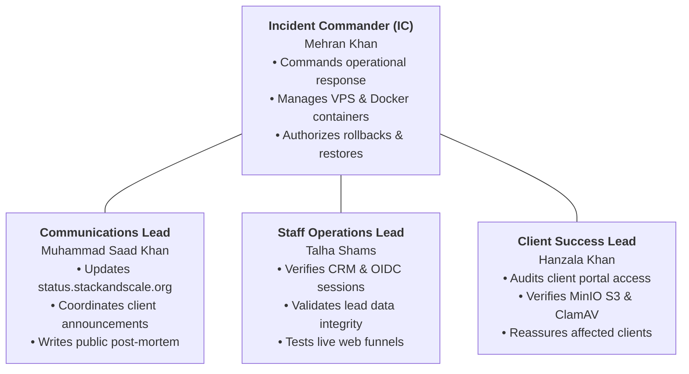

# Stack & Scale — Incident Response & Emergency Runbook

> **Authoritative Operational Policy:** Production Infrastructure (`51.195.136.215` / `stackandscale.org`)  
> **Incident Commander:** Mehran Khan (`mehrankhan`)  
> **Communications Lead:** Muhammad Saad Khan (`saadkhan`)  
> **Last Revised:** September 2026

This runbook defines the emergency operational protocol for handling service outages, security incidents, data degradation, and container failures on **Stack & Scale**.

---

## 1. Incident Severity Classification

| Severity Level | Definition & Criteria | Target Response | Target Resolution | Escalation Contact |
| :--- | :--- | :--- | :--- | :--- |
| **SEV-1 (Critical Outage)** | Complete platform outage (`stackandscale.org` down), database unavailability, active security breach, or total authentication failure. | **Immediate (< 15m)** | **< 2 hours** | Mehran Khan & Saad Khan |
| **SEV-2 (Major Degradation)** | Core subsystem degraded (e.g. MinIO S3 uploads failing, Keycloak SSO slow, CMS admin inaccessible), but public web online. | **< 30 minutes** | **< 6 hours** | Mehran Khan & Talha Shams |
| **SEV-3 (Minor Defect)** | Non-blocking bug in staff CRM drawer, cosmetic layout flaw, non-critical report export timeout. | **< 2 hours** | **< 24 hours** | Talha Shams / Saad Khan |
| **SEV-4 (Low / Inquiry)** | Documentation discrepancy, non-critical UI alignment issue, feature request. | Next business day | Next sprint cycle | Muhammad Saad Khan |

---

## 2. Incident Response Team Roles



---

## 3. Emergency Triage & Diagnostic Playbook

### Step 1: Check Live Container Status
Connect to the production host via SSH:
```bash
ssh ubuntu@51.195.136.215
docker ps --format "table {{.Names}}\t{{.Status}}\t{{.Ports}}"
```
Identify any containers marked `Exited`, `Restarting`, or `unhealthy`.

### Step 2: Inspect Real-Time Error Logs
Stream logs from the failing service (e.g. `api` or `web`):
```bash
docker logs --tail 100 --follow stack-and-scale-production-api-1
docker logs --tail 100 --follow stack-and-scale-production-web-1
```

### Step 3: Check Host Resource Utilization
Verify whether the host is experiencing CPU, RAM, or disk starvation:
```bash
df -h /
free -h
top -b -n 1 | head -n 20
```

---

## 4. Emergency Recovery Actions

### Action A: Single Container Restart
If a single container is unresponsive:
```bash
docker restart stack-and-scale-production-api-1
```

### Action B: Fast Rollback to Previous Stable Image
If a new release deployment introduced a regression, immediately roll back to the previous stable Git commit SHA:
```bash
cd /opt/stack-and-scale
# Revert image tag in .env.production
sed -i 's/RELEASE_DIGEST=.*/RELEASE_DIGEST=fa138f4e19947c5fd283f9c278d62656d743955c/' .env.production
# Pull and redeploy
docker compose --env-file .env.production -f infra/compose.production.yaml up -d --remove-orphans
```

### Action C: Database Disaster Recovery Restore
In the event of accidental data deletion or severe database corruption:
```bash
# 1. Identify latest clean backup
ls -lh /opt/stack-and-scale/backup/
# 2. Restore snapshot
cat /opt/stack-and-scale/backup/[TARGET_BACKUP].sql | docker exec -i stack-and-scale-production-postgres-1 psql -U stack_and_scale -d stack_and_scale
# 3. Restart dependent services
docker restart stack-and-scale-production-api-1 stack-and-scale-production-workers-1
```

---

## 5. Post-Mortem Template

Every SEV-1 and SEV-2 incident requires a post-mortem review within **48 hours** of resolution:

```markdown
# Incident Post-Mortem: [Incident Title]

- **Date & Time (UTC):** [Timestamp]
- **Duration of Outage:** [XX minutes]
- **Incident Commander:** Mehran Khan
- **Affected Services:** [API / Web / Keycloak / Database]
- **Customer Impact:** [Describe user-facing impact]

## 1. Root Cause Analysis (5 Whys)
- Why did the issue occur?
- Why did monitoring not detect it sooner?

## 2. Timeline of Events (UTC)
- `14:02` — Anomaly detected via Prometheus alert.
- `14:05` — IC assembled team.
- `14:15` — Root cause identified.
- `14:25` — Hotfix deployed; services recovered.

## 3. Preventative Action Items
- [ ] Action item 1 (Owner: Mehran Khan, Target: Next sprint)
- [ ] Action item 2 (Owner: Saad Khan, Target: Next sprint)
```
