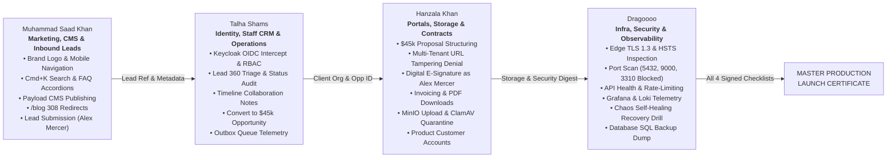

# Stack & Scale — End-to-End Team QA & Production Verification Suite

**Master Verification Matrix:** [Platform Blueprint v1.0](file:///media/saad/Data/stack_and_scale/STACK_AND_SCALE_PLATFORM_BLUEPRINT_V1.md) & [100 Architecture Question Decisions](file:///media/saad/Data/stack_and_scale/question-decisions/README.md)  
**Target Environment:** OVHcloud Production Host (`vps-5d4dfcb1`, Ubuntu 24.04 LTS)  
**Production Gateway:** `https://stackandscale.org`  
**Identity Gateway:** `https://identity.stackandscale.org`  
**Payload CMS Gateway:** `https://cms.stackandscale.org/admin`  
**API Gateway:** `https://api.stackandscale.org`  
**Public Status Gateway:** `https://status.stackandscale.org`

---

## 1. Collaborative Team Verification Architecture

Stack & Scale is tested through a **4-stage collaborative verification chain**. Each engineer owns an explicit operational boundary, executing click-by-click tests and passing cryptographic / transactional state to the next engineer in the pipeline.

---

## 2. Team Member QA Runbooks

| Member       | Assigned Engineer      | Scope & Architectural Focus                                                                                                                                                                                    | Runbook Document                                                                                                         |
| ------------ | ---------------------- | -------------------------------------------------------------------------------------------------------------------------------------------------------------------------------------------------------------- | ------------------------------------------------------------------------------------------------------------------------ |
| **Member 1** | **Muhammad Saad Khan** | Public Web, Design System, Command Palette, Payload CMS Editorial Lifecycle, `/blog` 308 Redirects & Inbound Lead Funnel                                                                                       | [`1-MUHAMMAD-SAAD-KHAN-MARKETING-CMS-CONVERSION.md`](./1-MUHAMMAD-SAAD-KHAN-MARKETING-CMS-CONVERSION.md)                 |
| **Member 2** | **Talha Shams**        | Keycloak OIDC Gateway, RBAC Protection, Staff Lead 360 Inbox, Opportunity Pipeline Conversion ($45,000 USD), Operations Outbox Telemetry & Knowledge Base                                                      | [`2-TALHA-SHAMS-IDENTITY-STAFF-CRM-OPERATIONS.md`](./2-TALHA-SHAMS-IDENTITY-STAFF-CRM-OPERATIONS.md)                     |
| **Member 3** | **Hanzala Khan**       | Commercial Proposals, Multi-Tenant Client Portal (`/portal/[id]`), Product Customer Account Portal (`/account/[id]`), Digital E-Signatures, Invoicing, MinIO S3 File Vault & ClamAV Antivirus Quarantine Drill | [`3-HANZALA-KHAN-CLIENT-PORTAL-PRODUCT-ACCOUNTS-STORAGE.md`](./3-HANZALA-KHAN-CLIENT-PORTAL-PRODUCT-ACCOUNTS-STORAGE.md) |
| **Member 4** | **Dragoooo**           | Network Perimeter Hardening, Port Scans, API Probes & Rate Limiting, Grafana Telemetry, Loki LogQL Queries, Container Chaos Self-Healing Drill & Disaster Recovery Backups                                     | [`4-DRAGOOOO-INFRA-SECURITY-OBSERVABILITY-DR.md`](./4-DRAGOOOO-INFRA-SECURITY-OBSERVABILITY-DR.md)                       |

---

## 3. Operational Rules of Engagement

1. **Sequential Execution:** Runbooks are executed in sequence from Member 1 &rarr; Member 2 &rarr; Member 3 &rarr; Member 4.
2. **Real Production Evidence:** Do not skip tests. Every operator must record their real timestamps, correlation IDs, and sign their respective verification sheets.
3. **No Zero-Byte Mocking:** Files uploaded and SQL dumps created must contain genuine bytes and pass structural validation.
4. **Final Gate Assembly:** Once all 4 sign-off tables are marked `Pass`, Dragoooo signs the Master Launch Summary to confirm complete platform readiness.
