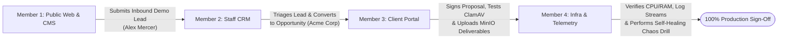

# Stack & Scale — End-to-End Team QA Master Plan

This directory contains the step-by-step, click-by-click manual testing runbooks designed for a 4-person engineering & operations team to thoroughly test and verify the entire Stack & Scale platform in production.

---

## Team Division & Assignment

Each document is fully self-contained with explicit instructions, button-by-button clicks, inputs, expected outcomes, and sign-off tables:

| Member | Focus Area | Runbook Document | Primary Environments & URLs |
|---|---|---|---|
| **Member 1** | **Marketing, CMS & Conversion** | [`MEMBER-1-MARKETING-CMS-CONVERSION.md`](./MEMBER-1-MARKETING-CMS-CONVERSION.md) | `https://stackandscale.org` `https://cms.stackandscale.org/admin` |
| **Member 2** | **Identity, Staff CRM & Operations** | [`MEMBER-2-IDENTITY-CRM-OPERATIONS.md`](./MEMBER-2-IDENTITY-CRM-OPERATIONS.md) | `https://identity.stackandscale.org` `https://stackandscale.org/staff` |
| **Member 3** | **Client Portal, Commercials & Storage** | [`MEMBER-3-COMMERCIALS-PORTAL-STORAGE.md`](./MEMBER-3-COMMERCIALS-PORTAL-STORAGE.md) | `https://stackandscale.org/portal/[id]` `https://api.stackandscale.org` |
| **Member 4** | **Infra, Security & Observability** | [`MEMBER-4-INFRA-SECURITY-OBSERVABILITY.md`](./MEMBER-4-INFRA-SECURITY-OBSERVABILITY.md) | Host `ubuntu@vps-5d4dfcb1` Grafana, Prometheus & Edge Probes |

---

## The Collaborative Verification Chain

The four runbooks are designed to form an interconnected validation chain:

1. **Member 1** creates and publishes a blog post in CMS, tests navigation/search, and submits an inbound demo request for *"Alex Mercer / Acme Global Technologies"*.
2. **Member 2** receives the lead in the Staff CRM Inbox, tests Keycloak SSO, adds internal timeline notes, and converts the lead into an active Opportunity.
3. **Member 3** creates a formal commercial proposal, tests the multi-tenant Client Portal, signs the agreement, and validates that clean deliverables pass ClamAV into MinIO while test malware is quarantined.
4. **Member 4** audits network firewalls, executes rate-limiting abuse tests, verifies container resource metrics in Grafana, and performs a container crash auto-recovery drill.
