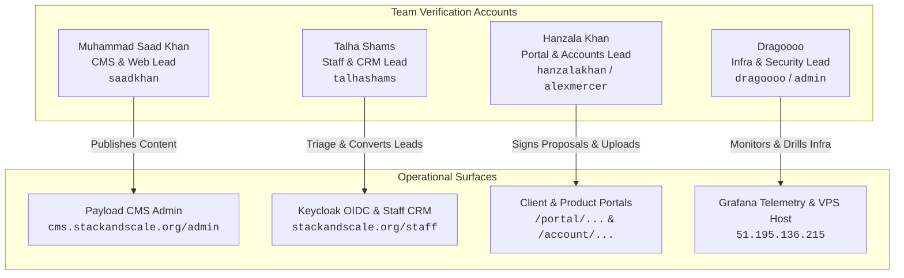

# Stack & Scale — Team Test Credentials & Operational Environment Matrix

> **Authoritative Target Environment:** Production VPS (`vps-5d4dfcb1` / `51.195.136.215`)  
> **Keycloak Realm:** `stack-and-scale`  
> **Base Domain:** `stackandscale.org`  
> **Generated:** September 2026

This document provides the authoritative credentials, operational endpoints, and role assignments provisioned on the production cluster for all 4 verification team members.

---

## 1. System Services & Endpoint Directory

| Service | Environment URL / Host | Purpose | Primary Owner |
|---|---|---|---|
| **Public Web & Marketing** | `https://stackandscale.org` | Main showcase, hero, navigation, FAQ accordions, lead forms | Muhammad Saad Khan |
| **Payload Headless CMS** | `https://cms.stackandscale.org/admin` | Article publishing, rich text, SEO metadata, media uploads | Muhammad Saad Khan |
| **Staff Operations Shell** | `https://stackandscale.org/staff` | CRM pipelines, Lead 360 drawers, opportunity conversion | Talha Shams |
| **Client Portal** | `https://stackandscale.org/portal/[clientOrganizationId]` | Proposals, milestone e-signatures, invoices, deliverables | Hanzala Khan |
| **Customer Account Portal**| `https://stackandscale.org/account/[accountOrganizationId]` | Product accounts, subscription management, seat allocations | Hanzala Khan |
| **Keycloak IAM Console** | `https://identity.stackandscale.org` | Single sign-on, OIDC tokens, role-based access control | Talha Shams & Dragoooo |
| **Grafana Telemetry** | `http://localhost:3001` *(via SSH tunnel)* | CPU/RAM metrics, Prometheus graphs, Loki log streams | Dragoooo |
| **MinIO S3 Console** | `storage:9000` *(Internal/Tunnel)* | Object storage bucket `stack-and-scale-private` | Dragoooo & Hanzala Khan |
| **Production VPS SSH** | `ssh ubuntu@51.195.136.215` | Container orchestration, database backups, logs | Dragoooo |

---

## 2. Team Member Credentials Matrix



### Member 1: Muhammad Saad Khan
- **Domain:** Marketing Website, Headless CMS, Article Publishing, Inbound Conversion
- **Runbook:** [`1-MUHAMMAD-SAAD-KHAN-MARKETING-CMS-CONVERSION.md`](file:///media/saad/Data/stack_and_scale/docs/qa/1-MUHAMMAD-SAAD-KHAN-MARKETING-CMS-CONVERSION.md)
- **Assigned Credentials:**
  - **Keycloak Staff IAM:**
    - Username: `saadkhan`
    - Email: `msaad.official6@gmail.com`
    - Password: `StackScale2026!#Saad`
    - Realm Roles: `admin`, `owner`, `manager`, `member`
  - **Payload CMS Admin:**
    - URL: `https://cms.stackandscale.org/admin`
    - Email: `msaad.official6@gmail.com`
    - Role: `admin` (super-admin content management)

---

### Member 2: Talha Shams
- **Domain:** Keycloak IAM Intercept, Staff CRM Shell, Lead 360 Operations, Outbox Telemetry
- **Runbook:** [`2-TALHA-SHAMS-IDENTITY-STAFF-CRM-OPERATIONS.md`](file:///media/saad/Data/stack_and_scale/docs/qa/2-TALHA-SHAMS-IDENTITY-STAFF-CRM-OPERATIONS.md)
- **Assigned Credentials:**
  - **Keycloak Staff IAM:**
    - URL: `https://identity.stackandscale.org`
    - Username: `talhashams`
    - Email: `talha.shams@stackandscale.org`
    - Password: `StackScale2026!#Talha`
    - Realm Roles: `manager`, `admin`, `member`
  - **Staff CRM Application:**
    - URL: `https://stackandscale.org/staff`
    - Auth Method: Single Sign-On (OIDC redirect via Keycloak)

---

### Member 3: Hanzala Khan
- **Domain:** Multi-Tenant Client Portal, Product Customer Accounts, S3 Uploads & ClamAV Quarantine
- **Runbook:** [`3-HANZALA-KHAN-CLIENT-PORTAL-PRODUCT-ACCOUNTS-STORAGE.md`](file:///media/saad/Data/stack_and_scale/docs/qa/3-HANZALA-KHAN-CLIENT-PORTAL-PRODUCT-ACCOUNTS-STORAGE.md)
- **Assigned Credentials:**
  - **Client Persona (Alex Mercer - Acme Corp):**
    - Portal URL: `https://stackandscale.org/portal/org-acme-prod`
    - Username: `alexmercer`
    - Email: `alex.mercer@acmecorp-testing.com`
    - Password: `StackScale2026!#Alex`
    - Role: `client_admin` / `member`
  - **Staff / Account Persona (Hanzala Khan):**
    - Account URL: `https://stackandscale.org/account/org-acme-prod`
    - Username: `hanzalakhan`
    - Email: `hanzala.khan@stackandscale.org`
    - Password: `StackScale2026!#Hanzala`
    - Realm Roles: `manager`, `member`

---

### Member 4: Dragoooo
- **Domain:** VPS Infrastructure, Network Isolation, TLS 1.3 / HSTS, Grafana Telemetry, Loki LogQL & DR Chaos
- **Runbook:** [`4-DRAGOOOO-INFRA-SECURITY-OBSERVABILITY-DR.md`](file:///media/saad/Data/stack_and_scale/docs/qa/4-DRAGOOOO-INFRA-SECURITY-OBSERVABILITY-DR.md)
- **Assigned Credentials:**
  - **Host SSH Access:**
    - Host: `51.195.136.215` (port 22)
    - User: `ubuntu`
    - Password: `[CONFIGURED_BY_ADMIN]`
    - App Directory: `/opt/stack-and-scale`
  - **Grafana Telemetry Dashboard:**
    - Tunnel Command: `ssh -L 3001:localhost:3000 ubuntu@51.195.136.215`
    - URL: `http://localhost:3001`
    - Username: `admin`
    - Password: `3672a5e96d2759c77cbcf8f7c10ce780a1d9d8af7b999952a34f6d3c9848b765`
  - **Keycloak Master Realm Admin:**
    - Console URL: `https://identity.stackandscale.org`
    - Realm: `master`
    - Username: `admin`
    - Password: `2d2641d5125f1fac78560e5664fe296936cb89fb5af0b68660af19292d9c7769`
  - **Keycloak Staff Admin:**
    - Username: `dragoooo`
    - Email: `dragoooo@stackandscale.org`
    - Password: `StackScale2026!#Dragoooo`
    - Realm Roles: `admin`, `owner`, `member`

---

## 3. Quick Verification Checklist

```
[ ] Muhammad Saad Khan: Logs into cms.stackandscale.org/admin with msaad.official6@gmail.com
[ ] Talha Shams: Logs into stackandscale.org/staff via Keycloak SSO with talhashams
[ ] Hanzala Khan: Accesses portal with alexmercer and account with hanzalakhan
[ ] Dragoooo: Tunnels into Grafana (localhost:3001) with admin password and inspects host health
```
