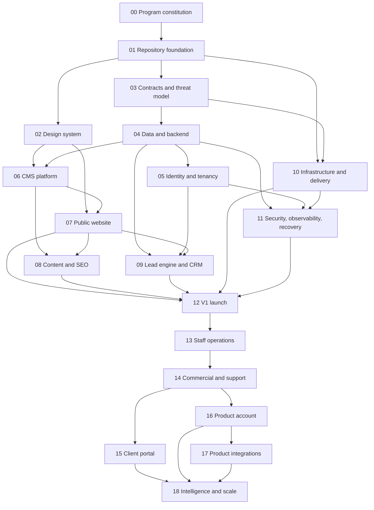

# Stack & Scale — Master Implementation Plan

**Status:** Approved for documentation-only Phase 00 execution after adversarial review  
**Planning date:** 24 August 2026  
**Initial external-platform ceiling:** USD 50/month  
**Repository mode:** Git repository on `master`; no remote or GitHub CLI currently available  
**Delivery mode until remote setup:** local feature branches and atomic commits; no PR claims until a remote is configured

## 1. Objective

Build the approved Stack & Scale software-company platform in controlled phases, beginning with a production-grade public website and lead engine, then internal operations, customer portals, product control-plane capabilities, product integrations, and finally evidence-driven intelligence and global scaling.

The plan must preserve all 100 approved decisions while preventing future features from inflating the initial release.

## 2. Definition of success

The program succeeds when:

- V1 launches within the USD 50 monthly external-platform ceiling;
- the public website communicates a product-led, globally credible company;
- structured leads reliably enter a permission-controlled CRM;
- content can be managed through Payload CMS without compromising the design system;
- infrastructure, backups, monitoring, identity and release controls are production-ready;
- post-launch modules can be added through documented contracts rather than architectural rewrites;
- no AI service is required for core operation;
- every phase has evidence-backed completion, rollback and handoff records.

## 3. Program invariants

These rules apply to every phase:

1. PostgreSQL is the central transactional data foundation.
2. The backend begins as a modular NestJS monolith.
3. Public and authenticated applications communicate through versioned contracts.
4. Tenant and permission checks occur server-side and at query boundaries.
5. Products may own separate databases and integrate through APIs/events.
6. Payload controls structured content; the design system controls presentation.
7. Open-source or free-tier services are preferred under the USD 50 ceiling.
8. Production data is not used in preview or development environments.
9. Migrations, payments, webhooks, provisioning and background jobs are idempotent and observable.
10. Accessibility, privacy, security, performance and recoverability are release criteria—not cleanup work.
11. Every deferred feature remains deferred until its phase gate opens.
12. AI is optional and cannot be on a critical path before Phase 18.

## 4. Delivery phases

| Phase | Outcome | Depends on | Initial-launch critical path? |
|---:|---|---|---|
| 00 | Program constitution and readiness | None | Yes |
| 01 | Repository and engineering foundation | 00 | Yes |
| 02 | Brand, UX and design system | 01 | Yes |
| 03 | Architecture contracts and threat model | 01 | Yes |
| 04 | Data and backend foundation | 03 | Yes |
| 05 | Identity, tenancy and authorization | 04 | Yes |
| 06 | CMS and content platform | 02, 04 | Yes |
| 07 | Public website experience | 02, 06 | Yes |
| 08 | Content, SEO and public search | 06, 07 | Yes |
| 09 | Lead engine, demo booking and CRM | 04, 05, 07 | Yes |
| 10 | Infrastructure, environments and delivery | 01; 10B waits for 03 | Yes |
| 11 | Security operations, observability and recovery | 04; 11B waits for 05 and 10B | Yes |
| 12 | V1 integration, hardening and launch | 07, 08, 09, 10, 11 | Yes |
| 13 | Staff operations platform | 05, 09, 12 | No |
| 14 | Commercial, support and document workflows | 13 | No |
| 15 | Custom-development client portal | 14 | No |
| 16 | Product-customer account and control plane | 14 | No |
| 17 | Product integrations and offline-first operation | 16 | No |
| 18 | Intelligence, automation and global scale | 15, 16, 17 plus operating evidence | No |

## 5. Dependency graph



## 6. Execution waves and parallelism

| Wave | Work | Parallel rule |
|---|---|---|
| A | Phase 00 | Serial: authority and constraints must be settled first |
| B | Phase 01 | Serial: creates the shared repository contract |
| C | Phases 02, 03 and 10A | 10A is provider-neutral container/IaC scaffolding only; disjoint write ownership is mandatory |
| D | Phase 04 | Serial critical foundation |
| E | Phases 05, 06 and 11A | 11A is telemetry conventions only after Phase 04; 11B waits for completed Phase 05 and 10B |
| F | Phase 07 | Integrates design and CMS foundations |
| G | Phases 08 and 09 | Parallel content/SEO and lead/CRM work with contract coordination |
| H | Finish 10B and 11B, then Phase 12 | Threat-model-dependent infrastructure, production monitoring/recovery, then launch gate |
| I | Phase 13 | Staff-platform foundation |
| J | Phase 14 | Shared commercial/support capabilities |
| K | Phases 15 and 16 | Client and product portals can run in parallel with disjoint app ownership |
| L | Phase 17 | Product integration and offline protocols |
| M | Phase 18 | Only after sufficient production evidence exists |

## 7. Initial critical path

```text
00 → 01 → 03 → 04 → 05 → 09 → 12
          ↘ 02 → 06 → 07 → 08 ↗
          ↘ 10 → 11 ──────────↗
```

The design/CMS path, platform/security path and infrastructure path converge at the V1 launch gate. A delay on any of these paths delays launch.

### Infrastructure and operations sub-gates

- **10A — provider-neutral foundation:** after Phase 01; container patterns, local orchestration and IaC module skeletons only.
- **10B — production infrastructure:** after Phase 03; network, edge, secret, backup and deployment controls derived from the accepted threat model.
- **11A — telemetry conventions:** after Phase 04; event correlation, structured logging, redaction and metric naming only.
- **11B — production operations:** after Phase 05 and 10B; identity-aware security operations, monitoring, geographically separate recovery and incident/status operation.

These sub-gates remove permission to provision production infrastructure before its security and capacity constraints are approved.

## 7A. Business-roadmap crosswalk

| Original business stage | Execution phases |
|---|---|
| Business Phase 1 — public V1 and lead foundation | 00–12 |
| Business Phase 2 — internal staff operations | 13 |
| Business Phase 3 — commercial and service operations | 14 |
| Business Phase 4 — client and product customer portals | 15–16 |
| Business Phase 5 — product integration, intelligence and scale | 17–18 |

When anyone says “Phase 1,” they must clarify whether they mean the original business stage or an execution phase number.

## 8. Repository and change workflow

Until a remote is configured:

1. create a local branch per executable step;
2. keep each change reviewable and limited to one responsibility;
3. run the phase verification suite;
4. record the result in the phase evidence log;
5. create an atomic local commit;
6. merge only after the phase gate passes.

After a Git remote and GitHub CLI are configured, the same steps become protected pull requests with required checks and preview deployments.

Suggested branch pattern:

```text
phase/00-program-constitution
phase/01-monorepo-foundation
feature/06-payload-products-collection
feature/09-demo-booking-flow
fix/12-launch-gate-accessibility
```

## 9. Verification ladder

Every executable step runs the checks relevant to its risk:

```text
Static checks
→ unit tests
→ integration tests
→ contract tests
→ browser journeys
→ accessibility checks
→ security/tenant tests
→ performance checks
→ deployment smoke tests
→ business-flow verification
```

A green build is not enough if the phase outcome is not demonstrated.

Before execution, every phase must be decomposed according to [`EXECUTION_DECOMPOSITION_STANDARD.md`](./EXECUTION_DECOMPOSITION_STANDARD.md). This is mandatory for Phases 13–17; Phase 18 capabilities become separately approved child phases.

## 10. Phase gate format

Every phase must produce:

- required source and configuration artifacts;
- tests and verification output;
- architecture decision updates for any justified deviation;
- operational or content handoff notes;
- actual and projected external-platform cost;
- rollback instructions;
- a signed-off exit checklist.

## 11. Plan mutation protocol

The plan may change only through one of these operations:

- **Split:** divide an oversized step without changing the phase outcome.
- **Insert:** add a prerequisite discovered during execution.
- **Reorder:** change dependency order with a documented graph update.
- **Defer:** move nonessential work to a later phase and preserve its contract.
- **Replace:** substitute a provider or component while maintaining the decision intent.
- **Abandon:** stop a direction when evidence shows it cannot meet the objective.

Each mutation records:

```text
Date
Affected phase and step
Evidence
Old approach
New approach
Dependency impact
Budget impact
Security/data impact
Approval
```

Silent scope changes are prohibited.

## 12. Anti-pattern catalog

Stop implementation when any of the following appears:

- building all applications before the public V1 is validated;
- creating microservices before module boundaries and load justify them;
- putting product operational data into the central platform without a defined need;
- using UI hiding as authorization;
- sharing production databases or secrets with previews;
- adopting several component libraries without design-system normalization;
- allowing arbitrary CMS layout control;
- implementing AI because the architecture is AI-ready;
- relying on one server copy as a backup;
- adding paid SaaS without budget and exit review;
- manually editing production schemas;
- releasing untested animation, 3D or third-party scripts that break performance or accessibility;
- collecting analytics without consent, purpose or retention rules;
- claiming a phase complete because tasks were checked off while its business outcome remains unproven.

## 13. Provider/version validation rule

The architecture is stable, but exact package versions and provider terms change. At the beginning of each implementation phase:

1. verify supported versions from official documentation;
2. pin exact versions and lockfiles;
3. record compatibility constraints;
4. test upgrades in preview/staging;
5. avoid automatic major-version upgrades.

The current official baseline supports Node.js 20.9+ for Next.js and Payload, Payload supports compatible Next.js 16.2.6+ releases, and NestJS requires Node.js 20+. Phase 01 will select the current supported Node LTS rather than relying only on minimum versions.

## 14. Program completion states

- **Ready:** dependencies and inputs are available.
- **In progress:** one execution owner and one current step are identified.
- **Verification:** implementation is frozen except for gate fixes.
- **Complete:** outcome, evidence, cost and rollback requirements pass.
- **Blocked:** a documented external decision or dependency prevents meaningful progress.
- **Superseded:** a recorded plan mutation replaced the phase.

Only one step per execution lane may be marked in progress. Multiple critical-path lanes may operate concurrently only when the dependency graph permits it and their write scopes are explicitly disjoint. Shared-contract work uses a serial contract lane and merges before consumer lanes.

## 15. Immediate next action

Begin documentation-only Phase 00. No application scaffolding, infrastructure provisioning or provider purchase may occur before Phase 00 freezes and validates the source-of-truth hierarchy, V1 scope, requirements trace, privacy implementation matrix, secrets/backup ADRs, capacity ledger, provider decision process and acceptance framework.
