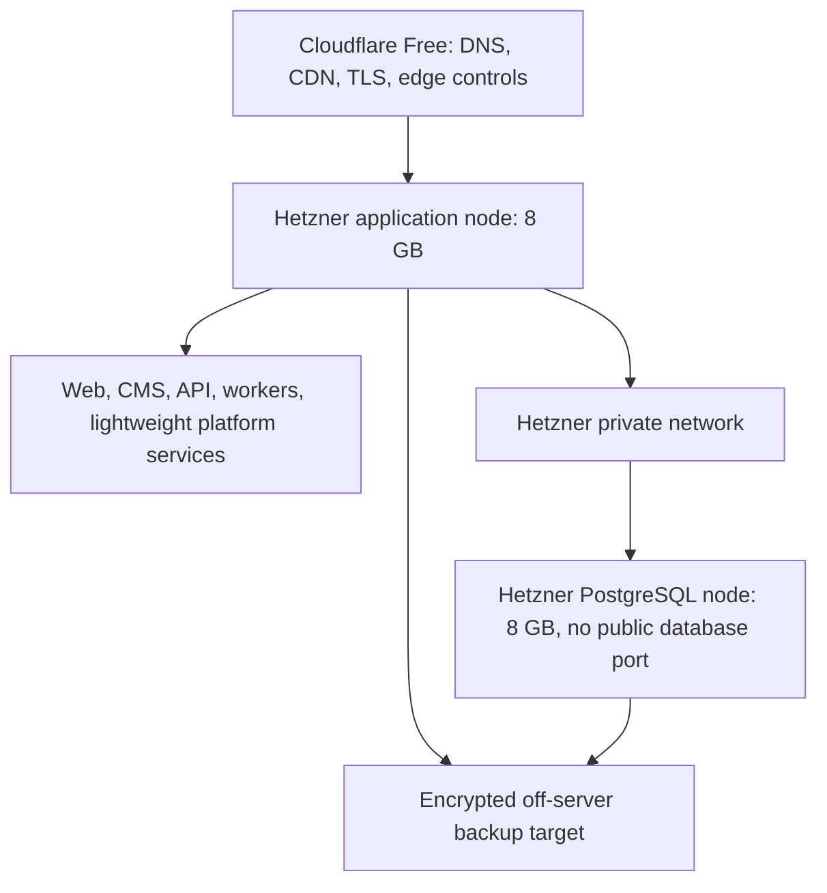

# Phase 10 — Infrastructure, Environments and Delivery

## Outcome

Create reproducible Hetzner infrastructure, isolated environments, container delivery and safe promotion while remaining below the USD 50 monthly ceiling.

## Execution profile

- **Model tier:** strongest for infrastructure/security; default for container manifests
- **Mode:** 10A begins after Phase 01; 10B begins only after Phase 03 and finalizes before Phase 11B/12
- **External-platform spend:** temporary staging only until launch
- **Depends on:** Phases 01 and 03
- **Unlocks:** Phases 11 and 12

## Initial production topology

## Work packages

### 10A.1 Provider-neutral container foundation

- After Phase 01, create local container patterns, health conventions, persistent-volume boundaries and an OpenTofu module skeleton only.
- Do not provision production resources, finalize firewall rules, select secret paths or configure backup credentials in 10A.
- Own only infrastructure/container directories assigned in the execution plan; do not modify Phase 03 security contracts.

### 10B.1 Infrastructure as code

- OpenTofu modules for project, network, firewall, nodes, IPs and backup-related configuration.
- Remote state strategy that does not expose secrets.
- Plan review and drift procedure.

### 10B.2 Container architecture

- Multi-stage, non-root images.
- Reproducible tags/digests.
- Health checks and graceful shutdown.
- Resource limits and persistent-volume boundaries.

### 10B.3 Environment isolation

- Local, test, ephemeral preview, staging and production contracts.
- Distinct secrets, databases, storage namespaces and domains.
- Sanitized fixtures only outside production.
- Ephemeral staging lifecycle to protect budget.

### 10B.4 Edge and origin security

- Cloudflare Free DNS/CDN/TLS baseline.
- Origin firewall accepts only required ports/sources where practical.
- Caddy, Traefik or Nginx reverse proxy selected through ADR.
- Security headers, request limits and safe cache policies.

### 10B.5 Deployment pipeline

- Build once, promote immutable artifact.
- Migration gate.
- Deploy, health check and business smoke test.
- Automatic failure stop and documented rollback.
- Deployment record with commit and schema version.

### 10B.6 Secrets, backup target and capacity controls

- Implement the approved Phase 00 secrets ADR, including production key custody, access evidence, rotation, break-glass and lost-key recovery.
- Select a geographically separate backup location and independent credentials/failure domain.
- Configure protected IaC state and include its recovery in the complete-system restore order.
- Apply resource reservations/limits from `docs/operations/CAPACITY-LEDGER.md` and define overload degradation behavior.

### 10B.7 Free-tier controls

- CI minutes and artifact retention budgets.
- Provider spending alerts.
- No always-on staging node.
- No paid Cloudflare tier.
- No public database IPv4 unless justified.

## Verification

- Recreate a non-production environment from code.
- Confirm production database is unreachable publicly.
- Destroy ephemeral staging cleanly.
- Simulate failed application deployment and rollback.
- Verify edge cache never stores authenticated/private responses.
- Produce a projected monthly bill below $50.
- Load the planned V1 service set and record measured CPU, memory, disk, I/O, database connections and safe headroom.
- Verify secret-access/recovery procedures and that primary credentials cannot delete the protected backup copy.

## Exit criteria

- Infrastructure plan is reproducible and reviewed.
- Environment isolation is proven.
- Deployment and rollback work using immutable artifacts.
- Budget projection leaves contingency.
- No manual server step is required without a corresponding runbook.
- Capacity measurements support the V1 service set with declared safe headroom and a priced scale trigger.

## Rollback and recovery

Retain the previous image and backward-compatible schema during promotion. Infrastructure rollback uses reviewed state/version restoration, not ad hoc console changes.

## Cold-start handoff

Read Questions 26, 27, 47–53, 78, 80–82 and 96. Budget does not justify removing database isolation or off-server recovery.
